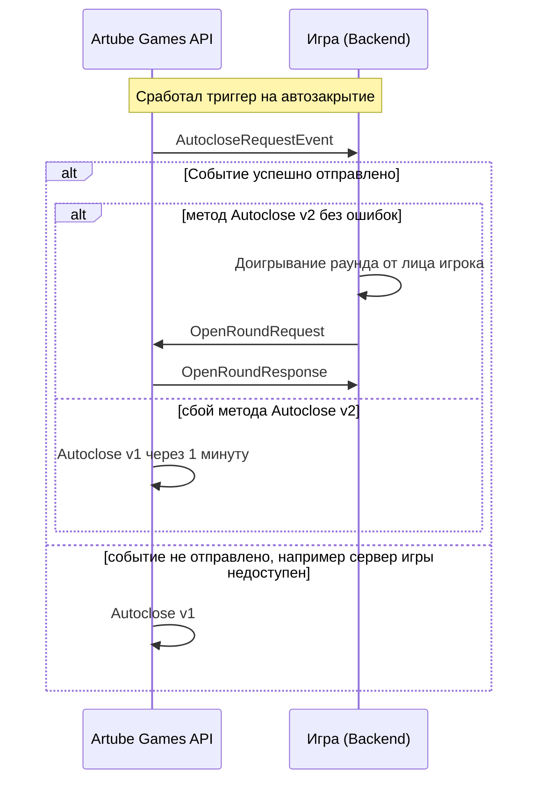

<!-- Source: https://docs.artube-888.live/ru/features/autoclose/ -->

# Обзор автозакрытия раунда

## Что такое Autoclose?

**Автозакрытие (Autoclose, автоклоуз)** — процесс автоматического доигрывания раундов встроеный в Games API.

## Назначение

Автоматическое доигрывание раундов, через промежуток времени, определяемый в В настройках для игры. Autoclose запускается раз в какое-то время, механизм доигрывает раунды так, как это сделал бы игрок. Цель - закрывать раунды через какое-то время, из-за требований некоторых платформ. Games API берет на себя почти всю ответственность за доигрывание раунда, обеспечивая его завершение в соответствии с заданными параметрами. Автозакрытие применяется только к раундам, которые были открыты, но не были закрыты игроком (т.е. использовлся сложный раунд з такими запросами как **[OpenRound](../games-api-integration/game-requests/open-round.md)**, **[UpdateRoundState](../games-api-integration/game-requests/update-round-state.md)** и **[CloseRound](../games-api-integration/game-requests/close-round.md)**). Это гарантирует, что раунды не останутся открытыми бесконечно и будут завершены в соответствии с установленными правилами.

Существуют два метода автозакрытия:

- **Autoclose v1**: Базовый метод используется как резервный, при котором для закрытия раунда производится rollback транзакция, раунд помечается как Rollback, как результат бэкенд игры не участвует в этом методе.
- **Autoclose v2**: Games API отправляет запрос на закрытие раунда **AutocloseRequestEvent**. Бэкенд игры доигрывает раунд от лица игрока и отправляет **AutocloseRoundRequest**. В случае неуспеха этого метода Games API использует резервный метод **Autoclose v1** через 1 минуту.

## Связанные разделы

- **[AutocloseRequestEvent](../games-api-integration/api-requests/autoclose-request-event.md)** - Событие запроса на автозакрытие раунда
- **[AutocloseRoundRequest](../games-api-integration/game-requests/autoclose-round.md)** - Запрос на автозакрытие раунда
