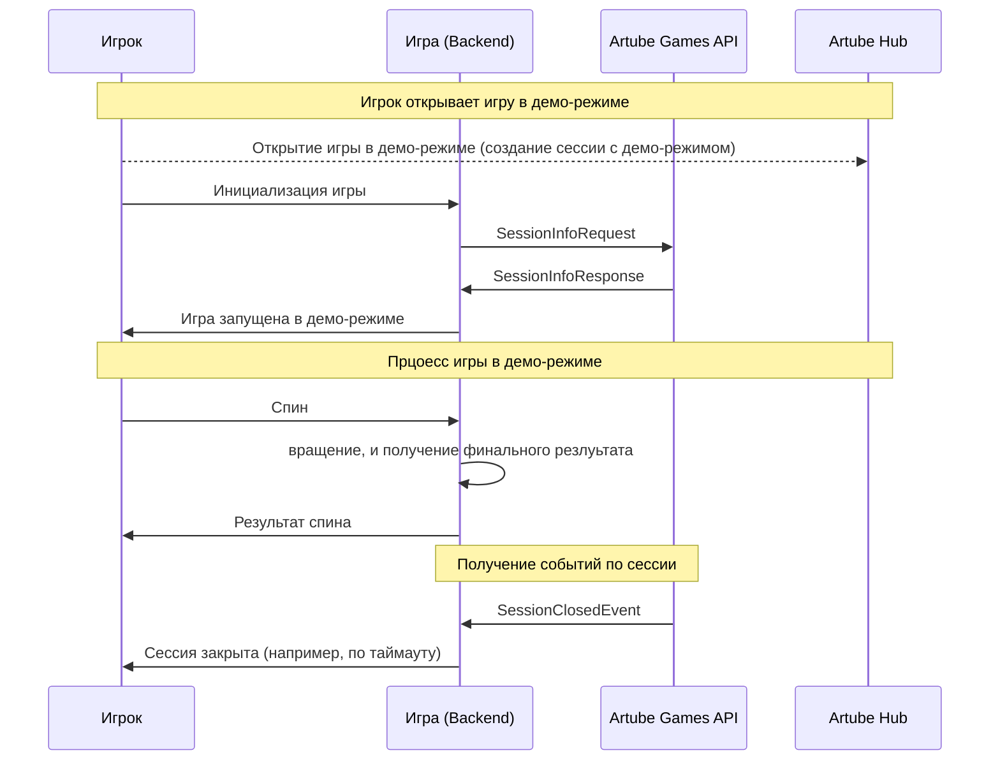

<!-- Source: https://docs.artube-888.live/ru/features/demo-mode/ -->

# Обзор демо-режима

## Что такое Демо-режим?

**Демо-режим** — режим, позволяющий игрокам попробовать игру без реальных ставок и выигрышей. Демо-режим является частью Artube хаба функционала, как и на других платформах где размещаются игры. Но, сам Games API не поддерживает демо-режим, тем самым позволяет самой игре полностью контролировать его реализациию на базе существующего функционала.

## Назначение

Демо-режим позволяет игрокам ознакомиться с игровым процессом и функционалом игры без риска потери реальных средств. Это полезно для привлечения новых игроков и демонстрации возможностей игры. В демо-режиме игроки могут использовать виртуальную валюту для ставок и выигрышей, что позволяет им понять механику игры и принять решение о том, хотят ли они играть на реальные деньги. Демо-режим также может быть полезен для тестирования новых функций и обновлений игры перед их выпуском на реальные ставки. Демо-режим является важным инструментом для привлечения и удержания игроков, а также для обеспечения положительного опыта игры.

### Реализация

## Важные моменты

- Демо-режим полностью контролируется игрой, и `rpc` запросы (такие как `PlayRound`, `OpenRound`, `UpdateRoundState`, `CloseRound`) в Games API не дают возможности отличить демо-режим от реального, так как это не поддерживается на уровне API.
- Демо сессия является таковой когда поле `currency` в `SessionInfoResponse` равно `null`. Это означает, что сессия является демо, и соответственно игра должна реализовать логику для демо-режима.
- Изменения виртуального баланса в демо-режиме должны быть реализованы на стороне игры. Игра должна самостоятельно отслеживать и обновлять виртуальный баланс игрока в демо-режиме на основе его действий и результатов игры с использованием кеш систем InMemory или Distributed, с TTL равным времени жизни сессии.
- Игроки в демо-режиме не могут выиграть реальные деньги, так как ставки и выигрыши в демо-режиме являются виртуальными и не имеют реальной денежной ценности. Это позволяет игрокам безопасно экспериментировать с игрой и ее механикой без риска финансовых потерь.

## Связанные разделы

- **[PlayRound](../games-api-integration/game-requests/play-round.md)** - Запрос на выполнение игрового раунда для простых игр
- **[OpenRound](../games-api-integration/game-requests/open-round.md)** - Запрос на открытие нового игрового раунда для интерактивных игр
- **[UpdateRoundState](../games-api-integration/game-requests/update-round-state.md)** - Запрос на обновление состояния раунда для интерактивных игр
- **[CloseRound](../games-api-integration/game-requests/close-round.md)** - Запрос на закрытие раунда и получение результата игры
- **[SessionClosedEvent](../games-api-integration/api-requests/session-closed.md)** - Событие, возникающее при закрытии сессии
