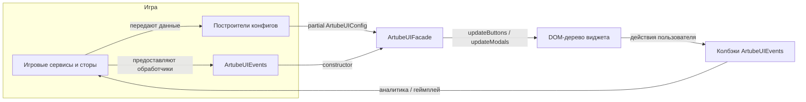

<!-- Source: https://docs.artube-888.live/ru/frontend-sdk/packages/artube-ui/ -->

# @artube/ui

## Обзор

`@artube/ui` включает готовый HUD и систему модальных окон для слотов. В пакет входят UI-примитивы (кнопки, селекторы, панели) и высокоуровневые сценарии (меню, окна ставок/автоигры/выхода, FRC-модалки и т.д.).

Пакет не зависит от фреймворков: вы работаете только с классами, обычными объектами и DOM-узлами. Никаких требований к React, MobX и т.п.

> Собственный UI допустим
>
> Использование `@artube/ui` **не обязательно**. Студия может реализовать полностью собственный UI, если он покрывает следующие обязательные для игрока функции: **смена ставки**, **autoplay** (автоигра), **правила игры** (paytable/rules), **spin** (запуск раунда), **turbo/speed-режим**, **включение/выключение музыки и звуковых эффектов**. `@artube/ui` — готовая реализация этих требований, но не единственно возможная.

> Artube loader обязателен в любом случае
>
> Независимо от выбора между `@artube/ui` и собственным UI, интеграция обязательного загрузочного экрана **[`@artube/loader`](artube-loader.md)** остаётся требованием платформы для всех игр. Собственный loader (если он есть у студии) допустимо показывать **до** или **после** Artube loader — но не вместо него.

Основная точка взаимодействия - [`ArtubeUIFacade`](#artubeuifacade). Ему нужны две сущности:

- **События** ([`ArtubeUIEvents`](#artubeuievents)) - колбэки, через которые виджет сообщает хост-игре о действиях игрока.
- **Конфиг** ([`ArtubeUIConfig`](#artubeuiconfig)) - декларативное описание текущего состояния HUD и модальных окон.

## Диаграмма архитектуры



Хост-игра владеет всеми данными и передаёт в [`ArtubeUIFacade`](#artubeuifacade) только объекты и колбэки.

[`ArtubeUIFacade`](#artubeuifacade) сам вычисляет дифф и обновляет свой DOM; хост не трогает разметку напрямую.

Действия игроков возвращаются через [`ArtubeUIEvents`](#artubeuievents), что позволяет запускать звуки, аналитику и игровую логику.

> Референсный пример интеграции
>
> Полный рабочий пример интеграции `@artube/ui` в игру на PixiJS v8 + TypeScript + ECS доступен в репозитории **Book of Artube** (`src/ui/artube/`): `ArtubeIntegration.ts` (создание facade, проброс колбэков), `HUDState.ts` (реактивное состояние кнопок по событиям игры), `providers/paytableProvider.ts` и `providers/rulesProvider.ts` (генерация данных таблицы выплат и правил). Используйте этот код как эталонную структуру для собственной интеграции.

## Установка

Установите пакет из внутреннего NPM-реестра:

```bash
npm install @artube/ui
```

> Конфигурация NPM registry — из репозитория Book of Artube
>
> Конфигурация доступа к внутреннему NPM registry для `@artube`-пакетов берётся из эталонного `.npmrc` репозитория **Book of Artube**. Добавьте в корень своего проекта файл `.npmrc` со следующим содержимым:
>
> ```ini
> @artube:registry=https://gitlab.com/api/v4/projects/81086971/packages/npm/
> //gitlab.com/api/v4/projects/81086971/packages/npm/:_authToken="${GITLAB_TOKEN}"
> ```
>
> Переменная `GITLAB_TOKEN` должна быть доступна в окружении при установке пакета (локально — как переменная окружения shell; в CI/CD — через **Settings → CI/CD → Variables** вашего GitLab-проекта). Токен должен иметь как минимум scope/permission **`read_registry`**.
>
> Список опубликованных версий пакета можно посмотреть в веб-интерфейсе GitLab Packages Registry группы `sdk`: `https://gitlab.com/artube-888-group/sdk/packages/-/packages`.

Импортируйте базовые стили:

```typescript
import '@artube/ui/style.css';
```

Важно

Убедитесь, что игра копирует все изображения, на которые ссылается виджет. Путь до ассетов должен быть резолвленным URL (например, через `import.meta.env.BASE_URL` у Vite).

## Стили контейнера

Виджет рендерится в обычный DOM-элемент. Назначьте ему стили ниже, чтобы HUD корректно перекрывал игровой рендер.

```css
.artube-ui-container {
  position: fixed;
  top: 0;
  left: 50%;
  transform: translateX(-50%);
  pointer-events: none;
  width: 100%;
  height: 100%;
  max-width: 100vw;
  max-height: 100vh;
}

@media screen and (orientation: landscape) {
  .artube-ui-container {
    aspect-ratio: 9 / 16;
    width: auto;
  }
}
```

## Lifecycle

1. **Задайте обработчики событий** - соберите [`ArtubeUIEvents`](#artubeuievents), которые мапят UI-действия (spin, autoplay, меню, модалки) на вашу игровую логику.
2. **Создайте экземпляр** - `new ArtubeUIFacade(events)`.
3. **Смонтируйте** - вызовите [`artubeUI.init(targetHTMLElement)`](#init) и передайте контейнер.
4. **Передайте стартовый конфиг** - [`artubeUI.updateConfig({ buttons: {...}, modals: {...} })`](#updateconfig) с начальными значениями (опционально).
5. **Реагируйте на состояние игры** - по изменениям данных вызывайте:

   - [`updateButtons(partialButtonsConfig)`](#updatebuttons) для HUD,
   - [`updateModals(partialModalsConfig)`](#updatemodals) для модалок,
   - [`updateConfig(partialArtubeUIConfig)`](#updateconfig) для структурных обновлений (меню, тексты и т.п.).

## Публичный API

### ArtubeUIFacade

| Метод | Описание |
| --- | --- |
| `new ArtubeUIFacade(events: ArtubeUIEvents)` | Создаёт виджет и привязывает обработчики. |
| [`init(target: HTMLElement)`](#init) | Монтирует виджет в DOM-ноду (вызвать один раз). |
| [`updateConfig(update: Partial<ArtubeUIConfig>)`](#updateconfig) | Применяет структурные изменения (меню, базовые состояния). |
| [`updateButtons(update: Partial<ButtonsConfig>)`](#updatebuttons) | Частично обновляет HUD-кнопки/панели. |
| [`updateModals(update: Partial<ModalsConfig>)`](#updatemodals) | Частично обновляет модалки. |

#### init

Монтирует виджет в указанный DOM-элемент. Вызывается один раз при инициализации.

```typescript
artubeUI.init(document.getElementById('artube-ui-container'));
```

#### updateConfig

Применяет структурные изменения конфигурации. Используется для обновления меню, базовых состояний и других глобальных настроек.

```typescript
artubeUI.updateConfig({
  buttons: { /* ButtonsConfig */ },
  modals: { /* ModalsConfig */ }
});
```

#### updateButtons

Частично обновляет HUD-кнопки и панели. Более эффективный способ обновления только кнопок без модалок.

```typescript
artubeUI.updateButtons({
  spin: { enabled: true, spinning: false },
  balancePanel: { value: 1000, visible: true }
});
```

#### updateModals

Частично обновляет модальные окна. Используется для показа/скрытия модалок и обновления их содержимого.

```typescript
artubeUI.updateModals({
  menu: { visible: true },
  bet: { visible: false }
});
```

### ArtubeUIEvents

```typescript
interface ArtubeUIEvents {
  buttons: {
    onSoundClick: () => void;
    onSpinClick: () => void;
    onContinuousSpinChange: (enabled: boolean) => void;
    onAutoplayClick: () => void;
    onMenuClick: () => void;
    onBetClick: () => void;
    onSpeedClick: () => void;
    onBonusClick: () => void;
    onGambleClick: () => void;
    onTakeClick: () => void;
  };
  menu: {
    onClose: () => void;
    onUIClick: () => void;
  };
}
```

Совет

Перенаправляйте все вызовы в игровые сервисы (стейт-машины, аналитику, звук).

### ArtubeUIConfig

```typescript
interface ArtubeUIConfig {
  buttons: Partial<ButtonsConfig>;
  modals: Partial<ModalsConfig>;
}
```

Примечание

Конфиг объединяется по частям, поэтому передавайте только изменённые фрагменты.

## ButtonsConfig и HUD-панели

| Ключ | Поля | Назначение |
| --- | --- | --- |
| `ui.visible` | `visible: boolean` | Главный переключатель видимости HUD. |
| `sound` | `visible: boolean` `enabled: boolean` `loading: boolean` `soundsEnabled: boolean` | Статус кнопки звука; `loading` для отображения процесса загрузки, `soundsEnabled` показывает, включён ли звук. |
| `speed` | `visible: boolean` `enabled: boolean` `isActive: boolean` | Переключатель турбо-режима. |
| `spin` | `visible: boolean` `enabled: boolean` `counter: number` `visibleCounter: boolean` `spinning: boolean` `continuousSpin: { delay: number; enabled: boolean }` | Управляет кнопкой спина и счётчиками. |
| `autoplay` | `visible: boolean` `enabled: boolean` `mode: 'start' \| 'stop'` `counter: number \| null` `spinning: boolean` | Состояние кнопки автоигры (режим, оставшиеся спины). |
| `menu`, `bet`, `bonus`, `gamble`, `take` | `visible: boolean` `enabled: boolean` | Доступность кнопок в зависимости от состояния игры. |
| `betPanel` | `values: number[]` `currentValue: number` `format: (value: number) => string` `onValueChange: (value: number, index: number) => void` `title?: string` `titleInside?: boolean` `enabled: boolean` | Селектор ставки. |
| `balancePanel`, `winPanel` | `visible: boolean` `title: string` `value: number` `format: (value: number) => string` | Отображение баланса и выигрыша с кастомным форматированием. |
| `freeSpinsPanel` | `visible: boolean` `count: number` | Количество оставшихся бесплатных спинов. |
| `promoPanel` | `visible: boolean` `text: string` | Промо-сообщения (хинты). |

## ModalsConfig

| Модалка | Обязательные поля | Назначение |
| --- | --- | --- |
| `menu` | `visible: boolean` `paytable: { title: string; data: PaytableProps }` `rules: { title: string; data: RulesProps }` `settings: { title: string; data: SettingsProps }` `lobby: { visible: boolean; onLobbyClick?: () => void }` `onClose: () => void` `onUIClick: () => void` | Комбинированное меню (таблица выплат, правила, настройки, переход в лобби). |
| `bet` | `visible: boolean` `lines: SelectorProps` `bets: BetSelectorProps` `settings: { currentOption: 'money' \| 'credits'; onChange: (option) => void }` `onClose: () => void` `onCancel: () => void` | Настройка ставок/линий и переключение валюты. |
| `autoplay` | `visible: boolean` `title: string` `options: number[]` `onOptionChange: (option, index) => void` `onClose: () => void` `onCancel: () => void` | Выбор количества автоспинов. |
| `exitLobby` | `visible: boolean` `description: string` `yesButton: string` `noButton: string` `onAccept: () => void` `onCancel: () => void` | Подтверждение выхода из лобби. |
| `reconnect` | `visible: boolean` `header: string` `alertingText: string` | Сообщения о переподключении. |
| `error` | `visible: boolean` `header: string` `description: string` `buttonText: string` `onClick: () => void` | Общая ошибка с кнопкой обновления. |
| `insufficient` | `visible: boolean` `header: string` `description: string` `buttonText: string` `onClick: () => void` | Недостаточно средств. |
| `limit` | `visible: boolean` `header: string` `description: string` `buttonText: string` `onClick: () => void` | Достигнуты лимиты (аналогично error). |
| `frcInfo` | `visible: boolean` `description: string` `tapToContinue: string` `onClose: () => void` | Информирование о Free Round Campaign. |
| `frcNew` | `visible: boolean` `campaign: string` `title: string` `validTo: string` `yesButton: string` `noButton: string` `onAccept/onCancel` | Предложение активировать новые FR. |
| `frcWin` | `visible: boolean` `header: string` `totalWin: string` `tapToContinue: string` `onClose: () => void` | Просмотр выигрыша по FRC. |
| `buyMore` | `visible: boolean + свои поля` | Апселл на покупку дополнительных бонусов. |
| `buyFeature` | `visible: boolean + свои поля` | Покупка бонус-фич. |

Примечание

Каждый объект модалки строится по схеме «видимость + данные + колбэки». Если модалка не нужна, просто не отправляйте её в [`updateModals`](#updatemodals).

## Контент меню и компоненты

### Paytable (PaytableProps)

#### payouts - таблица выплат:

```typescript
payouts: {
  format: value => currency.format(value),
  bet: balance.visibleBet,
  symbols: [
    {
      symbolName: 'high1',
      imageUrl: assets.basePath('images/paytable/high1.webp'),
      payouts: [
        { count: 3, factor: 10 },
        { count: 4, factor: 50 },
        { count: 5, factor: 1000 },
      ],
    },
  ],
}
```

#### symbols - описание спецсимволов:

```typescript
symbols: {
  title: t('menu.paytable.special'),
  symbols: [
    {
      symbolName: t('menu.paytable.high1'),
      imageUrl: assets.basePath('images/paytable/high1.webp'),
      points: [
        t('menu.paytable.high.t1'),
        t('menu.paytable.high.t2'),
      ],
    },
  ],
}
```

#### paylines - конфигурация линий:

```typescript
paylines: {
  title: t('menu.paytable.lines'),
  paylines: [
    {
      columns: 5,
      rows: 3,
      paylines: [
        { rowId: 1, paylineId: '1', indices: [1, 1, 1, 1, 1] },
        { rowId: 0, paylineId: '2', indices: [0, 0, 0, 0, 0] },
      ],
    },
  ],
}
```

### Rules (RulesProps)

#### sections - список разделов (`description` опционален):

```typescript
sections: [
  {
    title: t('menu.rules.about.header'),
    description: t('menu.rules.about.description').replace('{gameName}', `<b>${gameName}</b>`),
    points: [
      t('menu.rules.about.payouts'),
      t('menu.rules.about.paylines'),
      t('menu.rules.about.volatility'),
    ],
  },
]
```

#### info - общие сведения об игре:

```typescript
info: {
  gameName: 'Cash Machine 5',
  version: GAME_VERSION,
}
```

### Settings (включая SelectorProps)

Пример данных в меню настроек:

```typescript
const settingsData: SettingsProps = {
  settings: [
    {
      label: t('menu.settings.spacebar'),
      enabled: gameSettingsStore.isSpaceBarToSpin,
      onChange: (enabled) => gameSettingsStore.setIsSpaceBarToSpin(enabled),
    },
    {
      label: t('menu.settings.language'),
      options: ['English', 'Português', 'Español', 'Deutsch'],
      currentOption: localizationStore.currentLanguage,
      onChange: (lang) => localizationStore.setLanguage(lang),
    },
  ],
  credits: {
    enabled: true,
    settings: {
      label: 'Balance in Credits',
      enabled: gameSettingsStore.useCredits,
      onChange: (useCredits) => gameSettingsStore.setUseCredits(useCredits),
    },
    conversion: {
      title: `1 Credit = ${dataStore.currency}`,
      values: balanceStore.conversionRates,
      currentValue: balanceStore.currentConversionRate,
      format: (value) => value.toString(),
      onValueChange: (value) => console.log('conversion changed', value),
    },
  },
};
```

Общая форма [`SelectorProps`](#selectorprops):

```typescript
const betSelector: SelectorProps = {
  title: 'Bet',
  values: gameSettingsStore.useCredits ? balanceStore.allowedCredits : balanceStore.allowedBets,
  currentValue: gameSettingsStore.useCredits ? balanceStore.visibleCredit : balanceStore.visibleBet,
  format: (value) => formatCurrency(value),
  onValueChange: (value, index) => balanceStore.setServerBetFromIndex(index),
  titleInside: true,
  enabled: !stateMachine.isSpinning,
};
```

## Интеграционный флоу (framework-agnostic)

### Провайдеры данных

Реализуйте функции (например, [`getPaytableData`](#getpaytabledata), [`getRulesData`](#getrulesdata)), которые возвращают объекты нужного формата.

Держите их чистыми, без привязки к UI.

- [getPaytableData](#tab-panel-15)
- [getRulesData](#tab-panel-16)

```typescript
import { assets } from '../services/assets';
import { formatCurrency } from '../utils/number';

type Formatter = (value: number) => string;

export function getPaytableData(formatFn: Formatter, currentBet: number): PaytableProps {
  return {
    payouts: {
      format: formatFn,
      bet: currentBet,
      symbols: [
        {
          symbolName: 'high1',
          imageUrl: assets.basePath('images/paytable/high1.webp'),
          payouts: [
            { count: 3, factor: 5 },
            { count: 4, factor: 25 },
            { count: 5, factor: 500 },
          ],
        },
        {
          symbolName: 'wild',
          imageUrl: assets.basePath('images/paytable/wild.webp'),
          payouts: [
            { count: 3, factor: 10 },
            { count: 4, factor: 50 },
            { count: 5, factor: 1000 },
          ],
        },
      ],
    },
    symbols: {
      title: 'Special Symbols',
      symbols: [
        {
          symbolName: 'Wild',
          imageUrl: assets.basePath('images/paytable/wild.webp'),
          points: ['Substitutes for all symbols except Scatter', 'Doubles any win it participates in'],
        },
        {
          symbolName: 'Scatter',
          imageUrl: assets.basePath('images/paytable/scatter.webp'),
          points: ['Pays on any position', '3+ awards Free Spins'],
        },
      ],
    },
    paylines: {
      title: 'Paylines',
      paylines: [
        {
          columns: 5,
          rows: 3,
          paylines: [
            { rowId: 1, paylineId: '1', indices: [1, 1, 1, 1, 1] },
            { rowId: 0, paylineId: '2', indices: [0, 0, 0, 0, 0] },
          ],
        },
      ],
    },
  };
}
```

```typescript
type RulesContext = {
  rtp: number;
  version: string;
  gameName: string;
};

export function getRulesData(ctx: RulesContext): RulesProps {
  return {
    sections: [
      {
        title: 'About the Game',
        description: `${ctx.gameName} is a high volatility slot with classic symbols.`,
        points: [
          `RTP: ${ctx.rtp}%`,
          'Wins are paid from left to right on active paylines.',
          'Scatter wins pay on any position.',
        ],
      },
      {
        title: 'Free Spins',
        points: [
          '3+ Scatter symbols award 10 Free Spins.',
          'Retriggers add 5 additional Free Spins.',
        ],
      },
    ],
    info: {
      gameName: ctx.gameName,
      version: ctx.version,
    },
  };
}

// Usage
const paytableData = getPaytableData(formatCurrency, wagers.current);
const rulesData = getRulesData({
  rtp: gameConfig.rtp,
  version: GAME_VERSION,
  gameName: 'Cash Machine 5',
});
```

### Создание виджета

```typescript
import { ArtubeUIFacade } from '@artube/ui';

const artubeUI = new ArtubeUIFacade({
  buttons: {
    onSpinClick: () => game.startSpin(),
    onAutoplayClick: () => toggleAutoplay(),
    onContinuousSpinChange: enabled => analytics.track('continuous-spin', enabled),
    onMenuClick: () => modalStore.open('menu'),
    onBetClick: () => modalStore.open('bet'),
    onSpeedClick: () => settings.toggleTurbo(),
    onSoundClick: () => sound.toggle(),
    onBonusClick: () => bonus.open(),
    onGambleClick: () => gamble.enter(),
    onTakeClick: () => gamble.take(),
  },
  menu: {
    onClose: () => modalStore.close('menu'),
    onUIClick: () => sound.play('ui-click'),
  },
});

artubeUI.init(document.getElementById('artube-ui-container'));
```

### Инициализация состояния

```typescript
artubeUI.updateConfig({
  buttons: {
    ui: { visible: false },
    spin: {
      visible: true,
      enabled: false,
      spinning: false,
      visibleCounter: false,
      counter: 0,
      continuousSpin: { enabled: false, delay: 0 }
    },
    // ...остальные кнопки/панели
  },
  modals: {
    menu: {
      visible: false,
      paytable: {
        title: t('menu.paytable.header'),
        data: getPaytableData(formatAmount, balance.currentBet)
      },
      rules: {
        title: t('menu.rules.header'),
        data: getRulesData(game.rtp)
      },
      settings: {
        title: t('menu.settings.header'),
        data: settingsData
      },
      lobby: {
        visible: Boolean(game.lobbyUrl),
        onLobbyClick: () => navigation.openLobby()
      },
    },
    // ...остальные модальные окна по умолчанию
  },
});
```

### Реакция на рантайм обновления

- Обновляйте баланс/ставки через [`updateButtons`](#updatebuttons).
- Переключайте кнопки при смене фаз (спин, gamble, автоигра).
- Включайте нужные модалки через [`updateModals`](#updatemodals).
- При смене локализации/конфига повторно вызывайте [`updateConfig`](#updateconfig).

## Паттерны и примеры

### Синхронизация автоигры

```typescript
autoplay.onSpinsLeftChange(spinsLeft => {
  artubeUI.updateButtons({
    autoplay: {
      visible: true,
      enabled: true,
      mode: spinsLeft ? 'stop' : 'start',
      counter: spinsLeft,
      spinning: spinsLeft !== null,
    },
  });
});
```

### Обновление селектора ставки

```typescript
const betSelector = {
  values: wagers.getAllowedBets(),
  currentValue: wagers.current,
  format: value => currency.format(value),
  onValueChange: (value, index) => {
    wagers.select(index);
    analytics.track('bet-change', { value, index });
  },
};

artubeUI.updateButtons({
  betPanel: { title: 'Bet', titleInside: true, enabled: true, ...betSelector },
});

artubeUI.updateModals({
  bet: {
    visible: modalStore.isBetOpen(),
    bets: { ...betSelector, minLabel: 'Min', maxLabel: 'Max' }
  },
});
```

### Обновление модалки ставки

```typescript
const betModalPayload = {
  lines: {
    title: 'Lines',
    values: lines.getLines(),
    currentValue: lines
```
