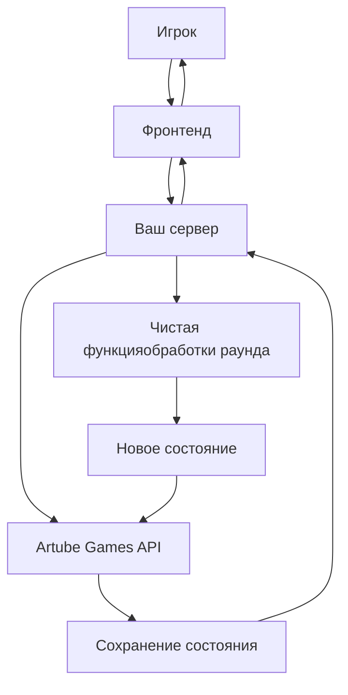

<!-- Source: https://docs.artube-888.live/ru/game-development/architecture/ -->

# Архитектура игры

## Общая структура игры

Артюбер предоставляет студиям полную экосистему для разработки и эксплуатации игр. Ниже представлена общая структура устройства игр для интеграции с Artube Games API:

## Принципы архитектуры игрового сервера

### Сервер без состояния (Stateless Server)

Важно для новичков

Ваш игровой сервер должен быть **stateless** - это означает, что он не хранит никакой информации о состоянии игры между запросами. Представьте сервер как калькулятор:

```typescript
// ✅ ПРАВИЛЬНО: Сервер как чистая функция
function calculateRound(gameState: GameState, playerAction: Action): GameResult {
  // Получили состояние -> обработали -> вернули результат
  const newState = processGameLogic(gameState, playerAction)
  return {
    newGameState: newState,
    rewards: calculateRewards(newState),
    nextActions: getAvailableActions(newState)
  }
}

// ❌ НЕПРАВИЛЬНО: Сервер хранит состояние
class BadGameServer {
  private gameStates = new Map<string, GameState>() // Плохо!

  processAction(playerId: string, action: Action) {
    // Хранит состояние в памяти - проблемы при перезапуске!
  }
}
```

### Зачем это нужно?

1. **Надежность**: Если сервер упадет, состояние не потеряется
2. **Масштабируемость**: Можно запустить несколько серверов
3. **Простота**: Легче тестировать и отлаживать

### Где хранится состояние?

Все состояние игры хранится в **Artube Games API**:

```typescript
// Весь жизненный цикл раунда
async function playRound(roundId: string, action: PlayerAction) {
  // 1. Получаем текущее состояние из Artube Games API
  const currentState = await artube.getRoundState(roundId)

  // 2. Обрабатываем действие игрока (чистая функция)
  const result = calculateRoundResult(currentState, action)

  // 3. Сохраняем новое состояние в Artube Games API
  await artube.saveRoundState(roundId, result.newState)

  // 4. Возвращаем результат игроку
  return result
}
```

## Чистые функции для игровой логики

### Основной принцип

Каждый раунд игры обрабатывается как **чистая функция**:

```typescript
// Входные данные → Функция → Результат
// (Состояние + Действие) → [Игровая логика] → (Новое состояние)

type PureGameFunction = (
  currentState: GameState,
  playerAction: Action
) => GameResult

// Пример для слота
function spinSlotMachine(
  state: SlotGameState,
  action: SpinAction
): SlotResult {
  // Генерируем символы
  const reels = generateRandomReels(state.rng)

  // Проверяем выигрышные линии
  const winLines = checkWinningLines(reels, state.payTable)

  // Рассчитываем выплату
  const payout = calculatePayout(winLines, action.bet)

  // Возвращаем НОВОЕ состояние (не изменяем старое!)
  return {
    newState: {
      ...state,
      balance: state.balance - action.bet + payout,
      lastSpin: reels,
      roundNumber: state.roundNumber + 1
    },
    result: {
      reels,
      winLines,
      payout,
      totalWin: payout
    }
  }
}
```

### Неизменяемость (Immutability)

Ключевой принцип

**Никогда не изменяйте входные данные** - всегда создавайте новые объекты:

```typescript
// ❌ ПЛОХО: Изменяем исходное состояние
function badUpdateBalance(state: GameState, amount: number) {
  state.balance += amount // Мутация!
  return state
}

// ✅ ХОРОШО: Создаем новое состояние
function updateBalance(state: GameState, amount: number): GameState {
  return {
    ...state, // Копируем все поля
    balance: state.balance + amount // Обновляем только нужное
  }
}

// Для сложных объектов
function updatePlayerStats(state: GameState, newStats: PlayerStats): GameState {
  return {
    ...state,
    player: {
      ...state.player, // Копируем игрока
      stats: {
        ...state.player.stats, // Копируем статистику
        ...newStats // Обновляем нужные поля
      }
    }
  }
}
```

### Пример полного раунда

```typescript
type RouletteState = {
  balance: number
  lastNumber: number | null
  roundId: string
  bets: Bet[]
}

type SpinAction = {
  bets: Bet[]
}

type RouletteResult = {
  newState: RouletteState
  result: {
    number: number
    winningBets: Bet[]
    totalPayout: number
  }
}

// Чистая функция обработки раунда рулетки
function playRouletteRound(
  state: RouletteState,
  action: SpinAction
): RouletteResult {
  // 1. Валидация
  const totalBet = action.bets.reduce((sum, bet) => sum + bet.amount, 0)
  if (totalBet > state.balance) {
    throw new Error('Insufficient balance')
  }

  // 2. Генерация результата
  const winningNumber = Math.floor(Math.random() * 37) // 0-36

  // 3. Проверка выигрышных ставок
  const winningBets = action.bets.filter(bet =>
    isWinningBet(bet, winningNumber)
  )

  // 4. Расчет выплат
  const totalPayout = winningBets.reduce((sum, bet) =>
    sum + bet.amount * getPayoutMultiplier(bet.type), 0
  )

  // 5. Создание нового состояния (не изменяем старое!)
  const newState: RouletteState = {
    ...state,
    balance: state.balance - totalBet + totalPayout,
    lastNumber: winningNumber,
    bets: [] // Сбрасываем ставки для нового раунда
  }

  return {
    newState,
    result: {
      number: winningNumber,
      winningBets,
      totalPayout
    }
  }
}

// Чистые вспомогательные функции
function isWinningBet(bet: Bet, number: number): boolean {
  switch (bet.type) {
    case 'straight': return bet.value === number
    case 'red': return isRed(number)
    case 'even': return number > 0 && number % 2 === 0
    // ... другие типы ставок
  }
}

function getPayoutMultiplier(betType: BetType): number {
  const multipliers = {
    'straight': 35,  // 35 к 1
    'red': 1,        // 1 к 1
    'even': 1,       // 1 к 1
    // ... другие множители
  }
  return multipliers[betType]
}
```

## Архитектура взаимодействия



### Последовательность обработки раунда

1. **Получение состояния**: `const state = await artube.getRoundState(roundId)`
2. **Обработка логики**: `const result = processRound(state, action)`
3. **Сохранение состояния**: `await artube.saveRoundState(roundId, result.newState)`
4. **Возврат результата**: `return result`

## Преимущества такого подхода

### Для разработчика

- **Простота тестирования**: Легко писать unit-тесты для чистых функций
- **Отладка**: Легко воспроизвести любую ситуацию
- **Понимание**: Четкий поток данных

### Для продакшена

- **Надежность**: Состояние не теряется при сбоях
- **Масштабируемость**: Можно добавлять серверы
- **Откат**: Легко откатить к предыдущему состоянию

### Пример тестирования

```typescript
describe('Slot Machine Logic', () => {
  it('should calculate correct payout for winning combination', () => {
    // Arrange
    const initialState: SlotState = {
      balance: 1000,
      bet: 10,
      roundNumber: 1
    }

    const spinAction: SpinAction = {
      bet: 50
    }

    // Act
    const result = spinSlotMachine(initialState, spinAction)

    // Assert
    expect(result.newState.balance).toBe(initialState.balance - 50 + result.result.payout)
    expect(result.newState.roundNumber).toBe(2)
    expect(result.newState).not.toBe(initialState) // Новый объект!
  })
})
```

## Простыми словами: Что должен делать сервер

Для новичков

Если вы только начинаете, запомните эти простые правила:

### 1. Сервер - это функция

```typescript
// Ваш сервер работает так:
function вашСервер(текущееСостояние, действиеИгрока) {
  // Обрабатывает действие
  const результат = обработатьИгру(текущееСостояние, действиеИгрока)

  // Возвращает новое состояние
  return результат
}
```

### 2. Не храните ничего в памяти

```typescript
// ❌ НЕ ДЕЛАЙТЕ ТАК
let баланс = 1000 // Потеряется при перезапуске!

// ✅ ДЕЛАЙТЕ ТАК
function получитьБаланс(игрокId) {
  return artube.getBalance(игрокId) // Всегда из API
}
```

### 3. Каждый запрос независим

```typescript
// Каждый запрос должен работать одинаково:
async function сыгратьРаунд(roundId, действие) {
  // 1. Взять состояние из Artube
  const состояние = await artube.getRoundState(roundId)

  // 2. Обработать
  const результат = обработатьДействие(состояние, действие)

  // 3. Сохранить обратно в Artube
  await artube.saveRoundState(roundId, результат.новоеСостояние)

  // 4. Вернуть игроку
  return результат
}
```

### 4. Создавайте новые объекты

```typescript
// ❌ Не изменяйте то, что получили
function плохо(состояние, ставка) {
  состояние.баланс -= ставка // Плохо!
  return состояние
}

// ✅ Создавайте новое
function хорошо(состояние, ставка) {
  return {
    ...состояние,
    баланс: состояние.баланс - ставка
  }
}
```

## Следующие шаги

- **[Хостинг и развертывание](hosting.md)** - узнайте о процессе развертывания фронтенда и бэкенда
- **[Инфраструктура как сервис](infrastructure.md)** - познакомьтесь с доступными сервисами
