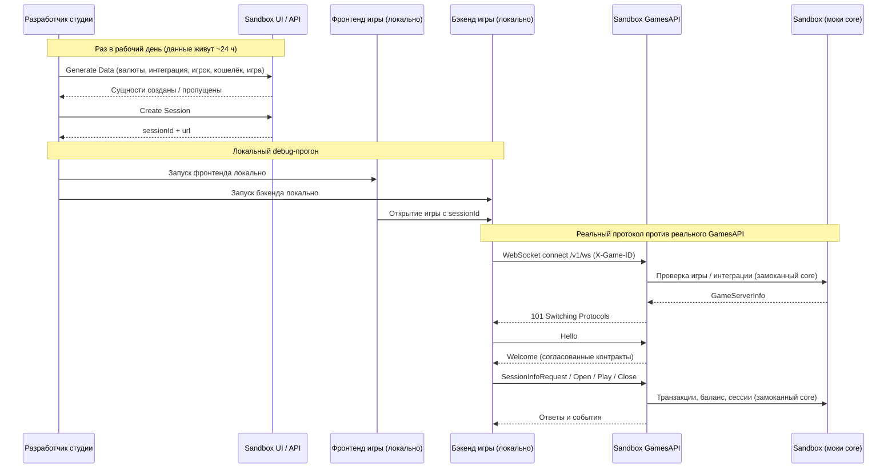

<!-- Source: https://docs.artube-888.live/ru/game-development/games-api-mock/mock-tests-description/ -->

# Artube Game API Sandbox

## Обзор

**Sandbox** — это **публично доступное тестовое окружение**, развёрнутое в отдельной `sandbox` инфраструктуре Artube. В этомй инфраструктуре рядом друг с другом работают два сервиса:

- **Sandbox** — Mock/Stub-реализация всех core-сервисов платформы. Он же предоставляет REST API и веб-интерфейс для подготовки тестовых данных.
- **GamesAPI** — **отдельный экземпляр настоящего Games API**: тот же самый сервис и тот же самый код, что работает на неймспейсах Dev и Prod, только с core-зависимостями, подменёнными моками Sandbox.

Главная ценность для игровой студии: **вы тестируете и отлаживаете игру против реального GamesAPI**, идентичного тому, что стоит на Dev и Prod, — без доступа к боевым сервисам и без локального подъёма чего-либо, кроме собственной игры.

> Совет
>
> Оба адреса **публичны**. Ни VPN, ни креды, ни заявка на доступ для начала работы не нужны.

## Точки подключения

| Назначение | Адрес |
| --- | --- |
| Sandbox API + Swagger UI (подготовка тестовых данных) | `https://sandbox-api-dev.artube-888.live/sandbox-swagger/` |
| Sandbox GamesAPI (WebSocket, к которому подключается игра) | `wss://gamesapi-sandbox.artube-888.live/v1/ws` |

Веб-интерфейс Sandbox отдаётся с того же хоста, что и Sandbox API, и состоит из двух страниц: основной страницы подготовки данных и страницы **Entity Docs** (`/docs`), где перечислены все сущности с их полями, типами и правилами валидации.

## Подготовка тестовых данных

Чтобы игра могла работать с sandbox-GamesAPI, нужна **Session**, а сессия может существовать только после того, как созданы сущности, от которых она зависит. Канонический порядок создания:

1. **Currency** — создаётся **дважды** (см. заметку ниже)
2. **Integration** — партнёр/тенант, которому принадлежит всё остальное
3. **Player** — принадлежит интеграции
4. **Wallet** — баланс игрока в одной валюте
5. **Game** — игра, идентифицируемая по `publicGameId`
6. **Session** — один игрок, одна игра, одна валюта
7. **Free-Round Campaign** — опционально, только для фичи FRC

В UI это выражено тремя действиями:

- **▶ Generate Data** — одной кнопкой прогоняет весь обязательный фундамент в правильном порядке: обе валюты, интеграцию, игрока, кошелёк и игру. Шаги дружелюбны к повторному запуску: уже существующие сущности помечаются как `SKIPPED`, а не приводят к ошибке, поэтому кнопку можно нажимать многократно. Каждый шаг попадает в лог с результатом (`CREATED` / `UPDATED` / `SKIPPED` / `FAILED`), HTTP-кодом, длительностью и сырым телом ответа.
- **🔗 Create Session & Copy to Clipboard** — отдельная кнопка в секции **Session**. Всегда создаёт новую сессию и копирует её id в буфер обмена; в ответе также приходит `url`, который открыл бы браузер игрока.
- **🎁 Create FRC Campaign** — отдельная кнопка в секции **Free-Round Campaign**. Она **неидемпотентна**: каждый клик создаёт новую кампанию и возвращает новый `campaignId`.

Session и Free-Round Campaign намеренно **исключены** из пакетного прогона — это действия по требованию, со своими редактируемыми телами запросов.

> Две валюты, одна из них базовая
>
> В обязательный фундамент входят **две сущности Currency**, и это не избыточность. Одна валюта — **базовая** (создаётся без `baseCurrency`), вторая ссылается на неё через `baseCurrency` и ненулевой `rate`.
>
> Именно эта пара делает работоспособной опциональную фичу **MaxWin**: лимит настраивается на Integration как `maxWinSettings.baseCurrencyValue` + `maxWinSettings.baseCurrency`, и платформа пересчитывает выигрыш раунда в эту базовую валюту по курсам. Валюта отдаётся как конвертируемый курс только тогда, когда её `baseCurrency` совпадает с запрошенной базой, — то есть без пары «базовая + производная» пересчитывать не через что и MaxWin посчитать нельзя.
>
> Дефолтный пресет использует `usd` как базовую валюту и `eur` с `baseCurrency: "usd"`, `rate: 1.1` как производную. Коды можно менять под свой тест-кейс, но связку «базовая — производная» нужно сохранить.

## Профили (pipelines)

UI позволяет держать **множество независимых пресетов** — они называются **pipelines** — каждый со своим полным набором тел запросов для всех шагов. Удобно держать по одному pipeline на игру, на интеграцию или на тест-кейс.

Доступные операции в секции **Pipelines**:

- **+ New pipeline** — клонирует пресет `Default` под новым именем
- **Rename** / **Delete** — управление существующими pipeline (переименование также начинается двойным кликом по имени)
- **Export** — выгружает все pipeline в версионированный JSON-файл
- **Import** — восстанавливает pipeline из такого файла

Любое JSON-тело редактируется на месте; правки валидируются по мере ввода и автоматически сохраняются после короткой задержки.

> Заметка
>
> **Все данные pipeline хранятся в `localStorage` вашего браузера** (ключ `sandbox.pipelines.v1`) — на сервере ничего не сохраняется. То есть pipeline привязаны к конкретному браузеру и машине; чтобы перенести их или поделиться пресетом с коллегой, используйте **Export** / **Import**.

## Время жизни данных: ~24 часа

Всё, что вы создаёте в sandbox-окружении, живёт **в среднем 24 часа**, после чего вычищается. Это сделано специально: окружение публичное, а его хранилища общие, и без периодической очистки они росли бы неограниченно.

Что это означает на практике:

- **сущности приходится пересоздавать практически каждый рабочий день** — вчерашняя сессия сегодня уже не работает;
- и именно поэтому **pipeline сохраняются в `localStorage`**: сами данные удаляются, а ваши payload’ы остаются, так что пересоздание — это пара кликов (**▶ Generate Data** → **🔗 Create Session**).

## Рабочий флоу разработчика студии

Целевой ежедневный цикл выглядит так:

1. Запускаете **фронтенд своей игры локально** (например, в debug-режиме из IDE).
2. Запускаете **бэкенд своей игры локально** (тоже в debug-режиме, с точками останова там, где нужно).
3. Направляете игру на sandbox-GamesAPI: `wss://gamesapi-sandbox.artube-888.live/v1/ws`.
4. Тестируете и отлаживаете против **реального GamesAPI** — того же сервиса и того же кода, что на Dev и Prod.



## Подключение к sandbox-GamesAPI

Подключение по WebSocket на адрес:

```text
wss://gamesapi-sandbox.artube-888.live/v1/ws
```

Заголовки, которые GamesAPI ожидает в upgrade-запросе:

| Заголовок | Обязателен | Примечание |
| --- | --- | --- |
| `X-Game-ID` | Да | Должен совпадать с `publicGameId` игры, созданной в Sandbox. |
| `X-Api-Key` | Условно | Нужен только если у Integration задан непустой `apiKey`. Если `apiKey` интеграции пуст, проверка пропускается. |

> HTTP 400 вместо 101
>
> Если handshake завершается **HTTP 400** вместо ожидаемого **101 Switching Protocols**, обычная причина — **попытка подключиться до того, как игра создана в Sandbox**: GamesAPI отклоняет запрос *до* апгрейда, если не может сопоставить `X-Game-ID` с зарегистрированной игрой (или если заголовок отсутствует). Сначала создайте игру (**▶ Generate Data**), затем подключайтесь. Неверный `X-Api-Key` у интеграции, где он задан, даёт тот же 400.

## Покрытие протокола

### Каналы и контракты

- `control` — `Hello`, `Welcome` (one-shot негоциация версий, не RPC)
- `rpc` — `SessionInfoRequest/Response`, `OpenRoundRequest/Response`, `PlayRoundRequest/Response`, `UpdateRoundStateRequest/Response`, `CloseRoundRequest/Response`, `AutocloseRoundRequest`, `Error`
- `events` — `SessionClosedEvent`, `NewConnectionEvent`, `BalanceChangedEvent`, `AutocloseRequestEvent`

> Важно для клиента протокола
>
> При установке соединения клиент обязан анонсировать в `Hello.payload.supports.contracts` **все** типы контрактов, которые Games API может отправить обратно на соединении — то есть не только Request-типы, но и соответствующие Response-типы, `Error` и все Event-типы. Контракты, не анонсированные клиентом, исключаются Games API из согласованного набора и не будут доставлены (сервер либо тихо отбросит сообщение, либо выбросит ошибку сериализации).

## Связанные разделы

- **[Как подключиться](../../games-api-integration/examples/how-to-connect.md)** — реальная интеграция
- **[Лимит максимального выигрыша](../../features/max-win.md)** — фича, которой нужна пара валют с базовой
- **[Обзор FRC](../../features/free-rounds-campaign.md)** — кампании фри-раундов
