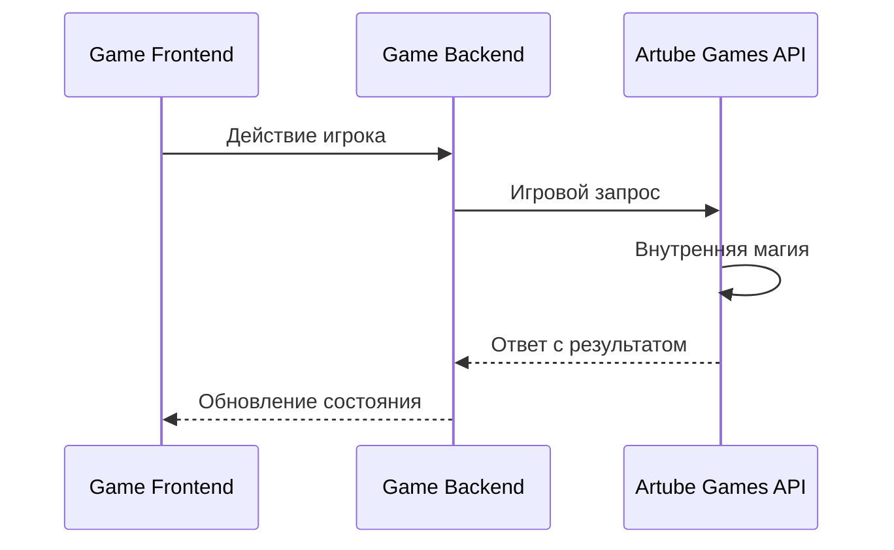
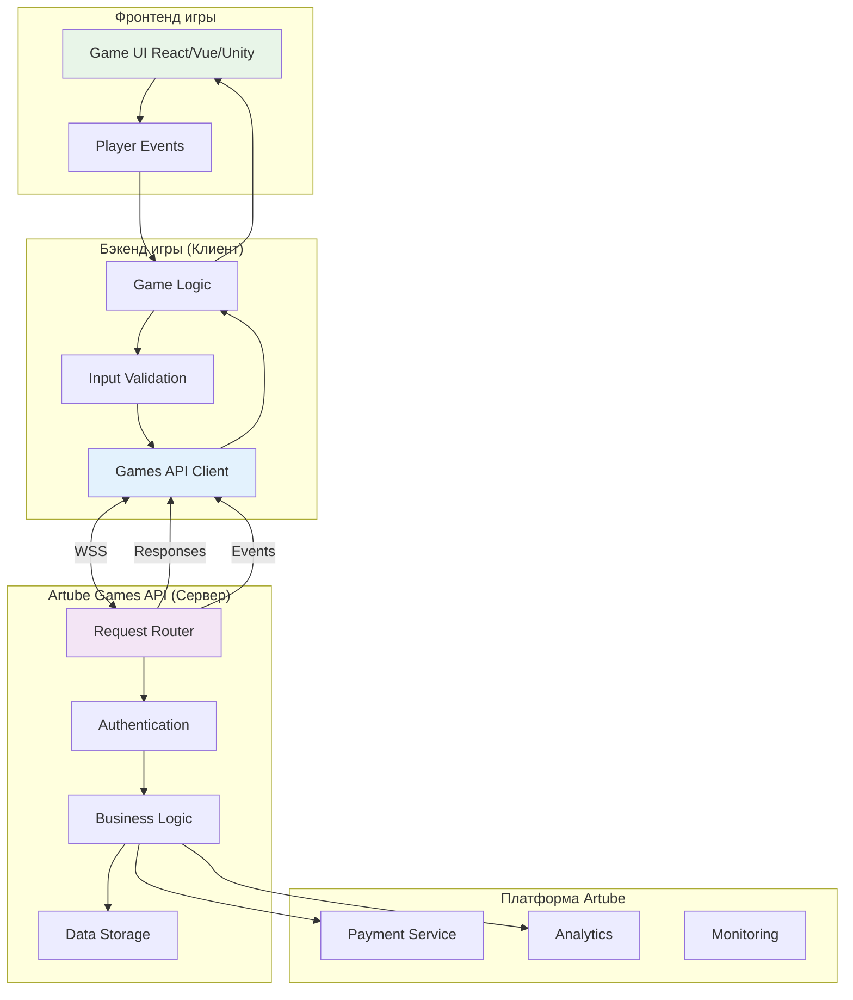

<!-- Source: https://docs.artube-888.live/ru/games-api-integration/api-overview/ -->

# Обзор API

## Что такое Artube Games API

**Artube Games API** - это центральное API платформы Artube, которое обеспечивает взаимодействие между играми и основной инфраструктурой платформы. Это единая точка входа для всех игровых операций, управления сессиями, обработки транзакций и получения игровых данных.

> Ключевые определения
>
> **Клиент** - это **бэкенд вашей игры** (не фронтенд!) **Сервер** - это **Artube Games API** платформы Artube
>
> **Игровой Клиент** - это **клиент вашей игры** **Игровой Сервер** - это **сервер вашей игры**

## Ключевые принципы

### 🎯 Архитектура взаимодействия

В нашей архитектуре важно четко понимать роли участников:

> Важно
>
> **Фронтенд игры** не взаимодействует с Artube Games API напрямую!

**Клиент (ваш бэкенд игры):**

- Инициирует запросы к Artube Games API
- Управляет игровой логикой и правилами
- Обрабатывает действия игроков от фронтенда
- Отвечает за безопасность и валидацию игры
- Получает уведомления от Artube Games API

**Сервер (Artube Games API платформы):**

- Обрабатывает запросы от игр
- Управляет балансами и транзакциями игроков
- Выполняет платежные операции
- Предоставляет игровые данные и сессии
- Отправляет системные уведомления

### 📡 Потоки данных и протокол общения

Все взаимодействие происходит по принципу **запрос-ответ** и **событийных уведомлений**:



### 📜 Типы контрактов (сообщений)

#### 🎮 Игровые контракты

**Инициируются бэкендом игры**

Ваш бэкенд отправляет запросы к Artube Games API для выполнения игровых операций и получения данных.

**Основные контракты:**

- [`SessionInfo`](game-requests/session-info.md) - получение данных сессии
- [`PlayRound`](game-requests/play-round.md) - выполнение простого раунда
- [`OpenRound`](game-requests/open-round.md) - начало сложного раунда
- [`UpdateRoundState`](game-requests/update-round-state.md) - обновление состояния
- [`CloseRound`](game-requests/close-round.md) - завершение раунда
- [`AutocloseRound`](game-requests/autoclose-round.md) - запрос на автозакрытие раунда

#### 📢 API контракты

**Инициируются Artube Games API**

Artube Games API отправляет уведомления вашему бэкенду о важных системных событиях.

**Основные события:**

- [`SessionClosedEvent`](api-requests/session-closed.md) - сессия завершена
- [`BalanceChangedEvent`](api-requests/balance-changed.md) - баланс изменен извне
- [`NewConnectionEvent`](api-requests/new-connection-event.md) - новое соединение
- [`AutocloseRequestEvent`](api-requests/autoclose-request-event.md) - запрос на автозакрытие

#### 📦 Конверт протокол

**Обертка для всех сообщений**

Все сообщения упаковываются в стандартный [`конверт`](protocol/envelope.md) с метаданными.

**Включает:**

- [`Версионирование`](protocol/versioning.md)
- [`Аутентификацию`](control-requests/hello.md)
- [`Сериализацию`](protocol/serialization.md)
- [`Обработку ошибок`](protocol/error-handling.md)

## Справочник контрактов

Все взаимодействие между игрой и Artube Games API происходит через стандартизированные **контракты** - структурированные сообщения с четко определенными форматами запросов и ответов.

### 🔗 Контрольные сообщения

Управляют жизненным циклом соединения:

| Контракт | Описание | Инициатор | Тип |
| --- | --- | --- | --- |
| **[Hello](control-requests/hello.md)** | Сообщение о максимальной версии схемы, если не получено в течении 5 секунд Games API считает что используется актуальная версия | Игра → API | Сообщение |
| **[Welcome](control-requests/welcome.md)** | Отправка уведомления о максимальной версии схемы, отправляется всегда независимо было ли полученно Hello | API → Игра | Уведомление |
| **[GoAway](control-requests/goaway.md)** | Корректное завершение соединения | API → Игра | Уведомление |

### 🎮 Игровые запросы

Основная игровая логика и управление раундами:

| Контракт | Описание | Инициатор | Назначение |
| --- | --- | --- | --- |
| **[SessionInfo](game-requests/session-info.md)** | Получение данных игровой сессии | Игра → API | Информация о сессии и балансе |
| **[PlayRound](game-requests/play-round.md)** | Выполнение простого игрового раунда | Игра → API | Одношаговые игры (слоты, рулетка) |
| **[OpenRound](game-requests/open-round.md)** | Начало интерактивного раунда | Игра → API | Многошаговые игры (блэкджек, покер) |
| **[UpdateRoundState](game-requests/update-round-state.md)** | Обновление состояния активного раунда | Игра → API | Промежуточные действия в раунде |
| **[CloseRound](game-requests/close-round.md)** | Завершение интерактивного раунда | Игра → API | Финализация многошагового раунда |
| **[AutocloseRound](game-requests/autoclose-round.md)** | Запрос на автозакрытие раунда | Игра → API | Автозакрытие многошагового раунда |

### 📡 События API

Системные уведомления от платформы к игре:

| Контракт | Описание | Инициатор | Назначение |
| --- | --- | --- | --- |
| **[SessionClosedEvent](api-requests/session-closed.md)** | Уведомление о закрытии сессии | API → Игра | Внешнее завершение сессии |
| **[BalanceChangedEvent](api-requests/balance-changed.md)** | Изменение баланса игрока | API → Игра | Внешние пополнения/списания |
| **[NewConnectionEvent](api-requests/new-connection-event.md)** | Уведомление о новом соединении | API → Игра | Смена активного соединения |
| **[AutocloseRequestEvent](api-requests/autoclose-request-event.md)** | Запрос на автозакрытие раунда | API → Игра | Внешний запрос на автозакрытие |

### 📦 Протокольные контракты

Техническая инфраструктура обмена сообщениями:

| Компонент | Описание | Документация |
| --- | --- | --- |
| **[Envelope](protocol/envelope.md)** | Структура обертки всех сообщений | Формат, метаданные, заголовки |
| **[Serialization](protocol/serialization.md)** | Правила сериализации данных | JSON схемы, кодировка |
| **[Versioning](protocol/versioning.md)** | Управление версиями протокола | Совместимость, миграции |
| **[Error Handling](protocol/error-handling.md)** | Обработка ошибок и исключений | Коды ошибок, retry логика |

## Потоки данных и протокол общения

### Полная схема взаимодействия



### Направления потоков данных

#### 🎮 Игра → Artube Games API (Исходящие запросы)

**Что отправляет ваш бэкенд:**

| Тип данных | Примеры | Назначение |
| --- | --- | --- |
| **Игровые запросы** | PlayRound, OpenRound, CloseRound, UpdateRoundState, AutocloseRound | Выполнение игровой логики и синхронизация игрового процесса |
| **Информационные запросы** | SessionInfo | Получение данных сессии |
| **Контрольные сообщения** | Hello | Управление соединением |

#### 📡 Artube Games API → Игра (Входящие события)

**Что получает ваш бэкенд:**

| Тип данных | Примеры | Назначение |
| --- | --- | --- |
| **Ответы на запросы** | SessionInfo, PlayRound, OpenRound, CloseRound | Результаты операций |
| **Системные события** | SessionClosedEvent, BalanceChangedEvent, NewConnectionEvent, AutocloseRequestEvent | Уведомления о состоянии |
| **Управляющие сигналы** | Welcome, GoAway | Контроль жизненного цикла |

### Типы протокола общения

> Важно для реализации
>
> Все сообщения должны обрабатываться **асинхронно** с поддержкой **retry логики** и **таймаутов**.

## Протокол общения

### Структура запроса

```json
{
  "proto": 1,
  "schema": 1,
  "chan": "rpc",
  "type": "SessionInfoRequest",
  "id": "01234567-89ab-cdef-0123-456789abcdef",
  "corr_id": null,
  "op_seq": 2,
  "timestamp": "2023-10-28T10:30:00.000Z",
  "payload": {
    "session_id": "12345678-1234-5678-9abc-123456789012",
    "player_connection_info": {
      "ip_address": "192.168.1.100",
      "user_agent": "Mozilla/5.0 (Windows NT 10.0; Win64; x64) AppleWebKit/537.36"
    }
  }
}
```

### Структура ответа

```json
{
  "proto": 1,
  "schema": 1,
  "chan": "rpc",
  "type": "SessionInfoResponse",
  "id": "response-session-info",
  "corr_id": "01234567-89ab-cdef-0123-456789abcdef",
  "op_seq": 2,
  "timestamp": "2023-10-28T10:30:01.000Z",
  "payload": {
    "security_hash": "a1b2c3d4e5f6789012345678901234567890abcd",
    "currency": "USD",
    "balance": 150.75,
    "last_round": {
      "round_id": "87654321-4321-8765-dcba-210987654321",
      "price_multiplier": 2.50,
      "bet_index": 2,
      "win_multiplier": 7.50,
      "free_round_campaign_id": "uuid-string", //nullable
      "started_at": "2023-10-28T10:30:00.000Z",
      "finished_at": "2023-10-28T10:30:00.000Z",
      "round_version": 0,
      "round_state_version": "1.0",
      "round_state": "{\"step\": 4, \"final_result\": \"win\"}"
    },
    "game_settings": {
      "default_bet_index": 3,
      "allowed_bets": [0.10, 0.25, 0.50, 1.00, 2.50, 5.00, 10.00],
      "available_auto_spin_counts": [10, 25, 50, 100, 250, 500],
      "rtp_options": {"rtp": 96.00, "game_mode": "MainGame", "volatility": "Low"}
    },
    "free_round_campaign": { //nullable
      "campaign_id": "uuid-string",
      "rounds_total": 10,
      "rounds_left": 5,
      "valid_from": "2023-01-01T00:00:00.000Z",
      "valid_to": "2023-01-01T00:00:00.000Z",
      "bet": 1.00,
      "total_win": 10.00,
      "is_complete": false
    },
    "history": [
      { "win": 5.00,"possible_win": 100.00, "is_own": false }
    ]
  }
}
```

## Аутентификация и безопасность

### API ключи

Каждая игра получает уникальные API ключи:

- **Production Key** - для `peoduction` среды
- **Development Key** - для `development` среды

## Обработка ошибок

### Типы ошибок

```json
{
  "proto": 1,
  "schema": 1,
  "chan": "rpc",
  "type": "Error",
  "id": "error-response-id",
  "corr_id": "01234567-89ab-cdef-0123-456789abcdef",
  "op_seq": 3,
  "timestamp": "2023-10-28T10:30:01.000Z",
  "payload": {
    "code": "BadRequest",
    "message": "invalid json",
    "details": {}
  }
}
```

### Коды ошибок

| Код | Описание | Действие |
| --- | --- | --- |
| `SessionInvalid` | Недействительная сессия | Переподключиться |
| `SessionIsNotInitialized` | Сессия не проинициализирована | вызвать SessionInfoRequest первым RPC запросом |
| `RegionNotSupported` | Недоступный регион | Изменить регион |
| `InvalidRoundOperation` | Неверная операция над “Сложным” раундом | Произвести правильную **последовательность** запросов Open - Update - Close |
| `TransactionFailed` | Не удалось выполнить транзакцию | Уведомить игрока |
| `InvalidOperationSequence` | Неверная последовательность сообщений | Исправить запрос |
| `BackPressureRejected` | Превышен лимит | Снизить частоту |
| `InternalServerError` | Внутренняя ошибка | Повторить позже |
| `BadRequest` | Ошибка валидации | Исправить запрос |
| `FrcNotFound` | Free Round Campaign не найдена | Исправить запрос |
| `FrcAlreadyCompleted` | Free Round Campaign завершена | Исправить запрос |
| `InsufficientFunds` | Недостаточно средств | Уведомить игрока |
| `OperationNotAllowed` | Данная операция не разрешена. Подробности в сообщении | Исправить запрос |

## Мониторинг и отладка

### Логирование

Все запросы логируются с:

- Уникальными ID сообщений
- Временными метками
- Результатами выполнения
- Ошибками и их причинами

### Метрики

Отслеживаются:

- Время ответа API
- Частота ошибок
- Нагрузка по играм
- Производительность операций

## Окружения

### Sandbox

**URL:** `https://sandbox-api-dev.artube-888.live/sandbox-swagger/`

- Тестовые данные
- Фиктивные транзакции
- Безопасное тестирование
- Полная функциональность

> Совет
>
> Всё, что связано со средой песочницы, вы настраиваете самостоятельно. Для получения дополнительной информации нажмите **[Sandbox - mock-окружение GamesAPI](../game-development/games-api-mock/mock-tests-description.md)**.

### Develop

- Реальные данные
- Тестовые транзакции
- Мониторинг

### Production

- Реальные данные
- Настоящие транзакции
- Мониторинг 24/7
- SLA гарантии

## Быстрый старт интеграции

### 📚 Изучение документации (рекомендуемый порядок)

1. **[Протокол общения](protocol/envelope.md)** - структура всех сообщений
2. **[Установка соединения](examples/how-to-connect.md)** - практическое подключение
3. **[Простые раунды](examples/simple-round-examples.md)** - базовая игровая логика
4. **[Сложные раунды](examples/complex-round-examples.md)** - интерактивные игры

### 🎯 Контракты по категориям

**Начните с основ:**

- [`Hello`](control-requests/hello.md) - первое подключение
- [`SessionInfo`](game-requests/session-info.md) - получение данных игрока
- [`PlayRound`](game-requests/play-round.md) - простейший игровой запрос

**Игровые контракты (инициируются вашей игрой):**

- [`OpenRound`](game-requests/open-round.md) - начало интерактивного раунда
- [`UpdateRoundState`](game-requests/update-round-state.md) - обновление состояния
- [`CloseRound`](game-requests/close-round.md) - завершение раунда
- [`AutocloseRound`](game-requests/autoclose-round.md) - запрос на автозакрытие раунда

**API события (инициируются платформой):**

- [`SessionClosedEvent`](api-requests/session-closed.md) - закрытие сессии
- [`BalanceChangedEvent`](api-requests/balance-changed.md) - изменение баланса
- [`NewConnectionEvent`](api-requests/new-connection-event.md) - новое соединение
- [`AutocloseRequestEvent`](api-requests/autoclose-request-event.md) - запрос на автозакрытие раунда

**Протокольные компоненты:**

- [`Envelope`](protocol/envelope.md) - обертка сообщений
- [`Serialization`](protocol/serialization.md) - форматы данных
- [`Error Handling`](protocol/error-handling.md) - обработка ошибок
- [`Versioning`](protocol/versioning.md) - совместимость версий

### 🛠️ Инструменты разработки

- **[Sandbox для тестирования](../game-development/games-api-mock/mock-tests-description.md)** - локальная разработка
- **[Примеры подключения](../game-development/backend/api-connection-guide.md)** - готовые решения
