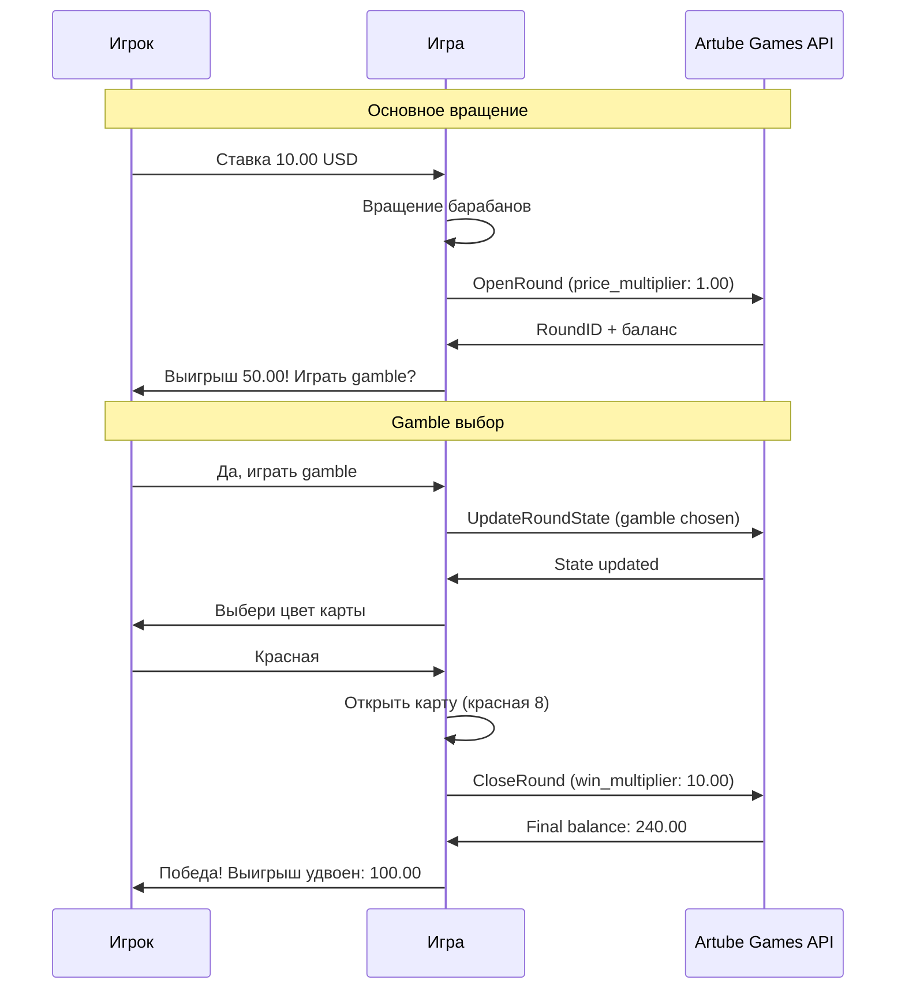
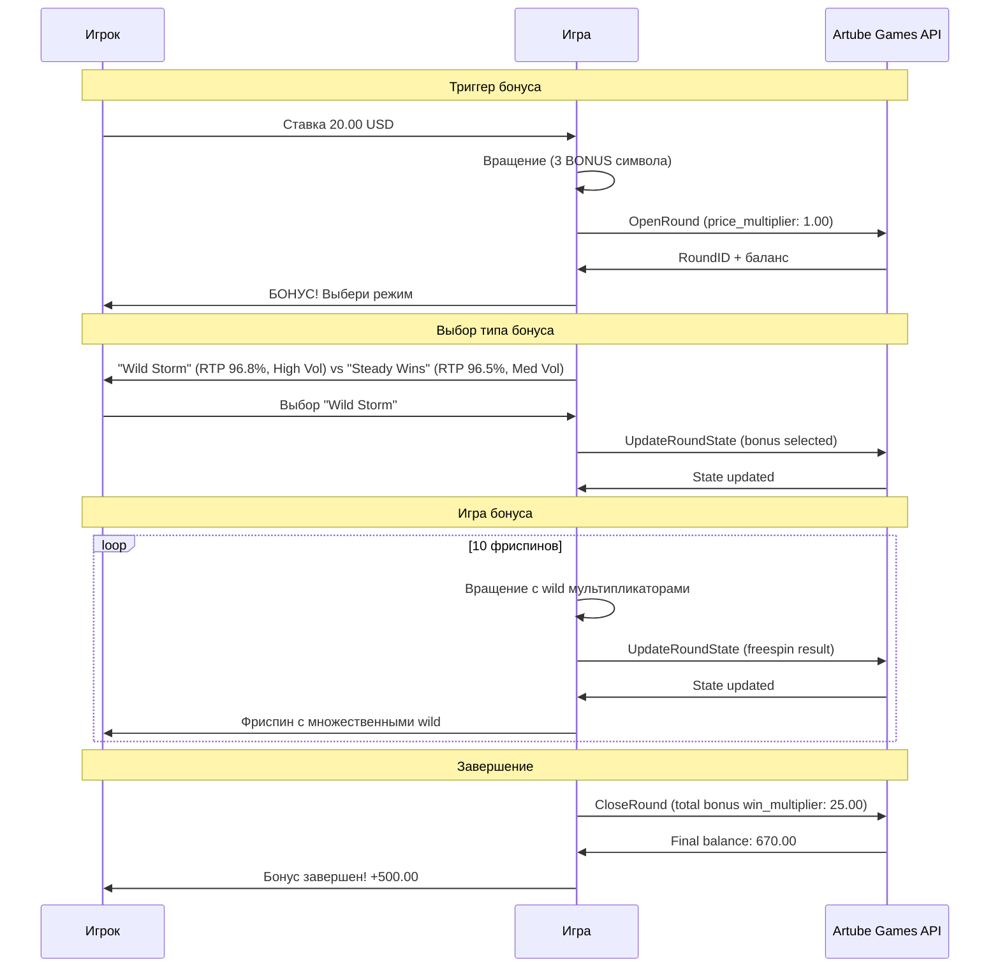
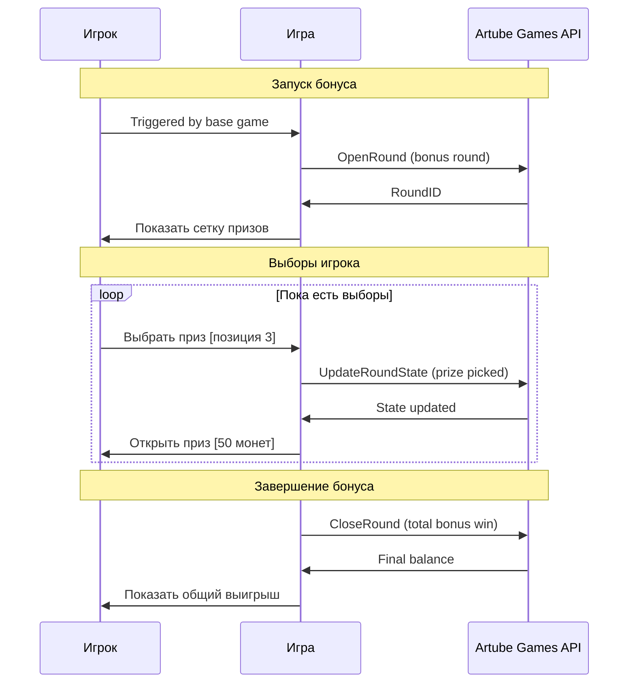
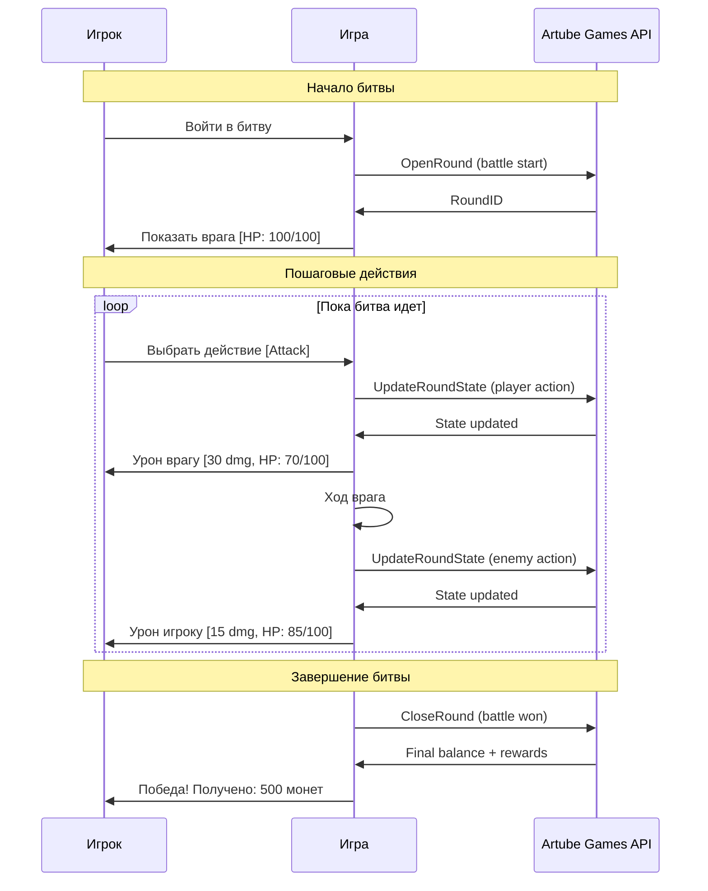

<!-- Source: https://docs.artube-888.live/ru/games-api-integration/examples/complex-round-examples/ -->

# Примеры сложных раундов

## Обзор

Детальные примеры реализации сложных игровых раундов с пользовательским интерактивом, использующих последовательность [`OpenRound`](../game-requests/open-round.md) → [`UpdateRoundState`](../game-requests/update-round-state.md) → [`CloseRound`](../game-requests/close-round.md) или [`OpenRound`](../game-requests/open-round.md) → [`CloseRound`](../game-requests/close-round.md).

## Сценарий 1: Слот с функцией Gamble

Интерактивный слот, где после выигрыша игрок может выбрать - забрать выигрыш или попытаться его удвоить в gamble-игре.

### Схема слота с gamble

## Сценарий 2: Слот с выбором бонуса

Интерактивный слот, где при активации бонуса игрок может выбрать между двумя режимами с разными характеристиками RTP и волатильности.

### Схема выбора бонуса

## Сценарий 3: Интерактивный бонус слота

Бонусная игра слота с выбором призов игроком.

### Схема бонусной игры

## Сценарий 5: Пошаговая RPG битва

Пошаговая боевая система с выбором действий.

### Схема RPG битвы

> Совет
>
> Сложные раунды позволяют создавать богатый игровой опыт с множественными взаимодействиями. Тщательно планируйте состояния и переходы между ними.

## Связанные разделы

- **[Сложный раунд](../../integration-process/games-api/complex-round.md)** - концепция сложных раундов
- **[OpenRound](../game-requests/open-round.md)** - начало интерактивного раунда
- **[UpdateRoundState](../game-requests/update-round-state.md)** - обновление состояния
- **[CloseRound](../game-requests/close-round.md)** - завершение раунда
- **[Простые раунды](simple-round-examples.md)** - для сравнения
