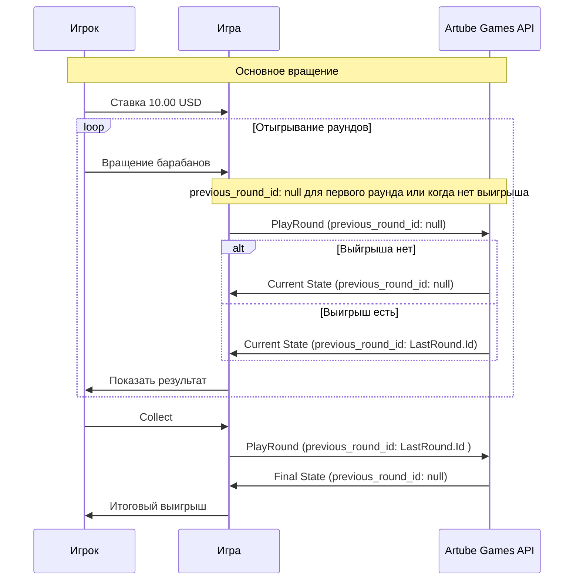

<!-- Source: https://docs.artube-888.live/ru/games-api-integration/examples/round-chain-examples/ -->

# Примеры цепочек раундов

## Обзор

Пример реализации игровых раундов связанных между собой, где результат одного раунда влияет на следующий, как в Chicken Road. Использоваться может последовательность запросов [`OpenRound`](../game-requests/open-round.md) или [`PlayRound`](../game-requests/play-round.md). Важно передавать `previous_round_id` для связи раундов в цепочке. Использование `previous_round_id` позволяет отслеживать последовательность раундов и корректно обрабатывать результаты.

> Осторожно
>
> Games API не требует обязательного использования `previous_round_id` для всех раундов, но его использование обеспечивает правильную связь между раундами в цепочке. Без `previous_round_id` раунды будут рассматриваться как независимые, что может привести к некорректной обработке результатов и нарушению логики игры.

## Сценарий 1: Простые связанные раунды

Слот, где каждый последующий выигрышный раунд связан с результатом предыдущего. Каждый такой раунд отыгрывается с `previous_round_id` для связи.

### Схема цепочки раундов

> Совет
>
> Как правило COLLECT запрос также является раундом, который должен быть связан с предыдущими раундами в цепочке через `previous_round_id`, чтобы обеспечить правильную обработку результатов и корректное обновление баланса игрока. Так же если в игре предусмотрена возможность изменения ставки между раундами, то `ChangeBet` запрос также может являться раундом и должен быть связан с предыдущими раундами через `previous_round_id`.

## Связанные разделы

- **[OpenRound](../game-requests/open-round.md)** - начало интерактивного раунда
- **[PlayRound](../game-requests/play-round.md)** - выполнение игрового раунда
