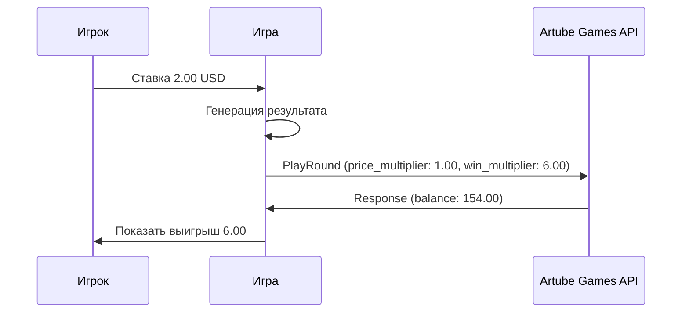

<!-- Source: https://docs.artube-888.live/ru/games-api-integration/examples/simple-round-examples/ -->

# Примеры простых раундов

## Обзор

Этот раздел содержит детальные примеры реализации простых игровых раундов для различных типов игр. Все примеры используют операцию [`PlayRound`](../game-requests/play-round.md) для выполнения полного цикла в одном запросе.

## Сценарий 1: Классический слот

### Обычное вращение с выигрышем

> Совет
>
> Все примеры показывают серверную генерацию результатов. Никогда не доверяйте результатам, полученным с клиента!

## Связанные разделы

- **[Простой раунд](../../integration-process/games-api/simple-round.md)** - концепция простых раундов
- **[PlayRound](../game-requests/play-round.md)** - API для простых раундов
- **[Примеры сложных раундов](complex-round-examples.md)** - интерактивные игры
