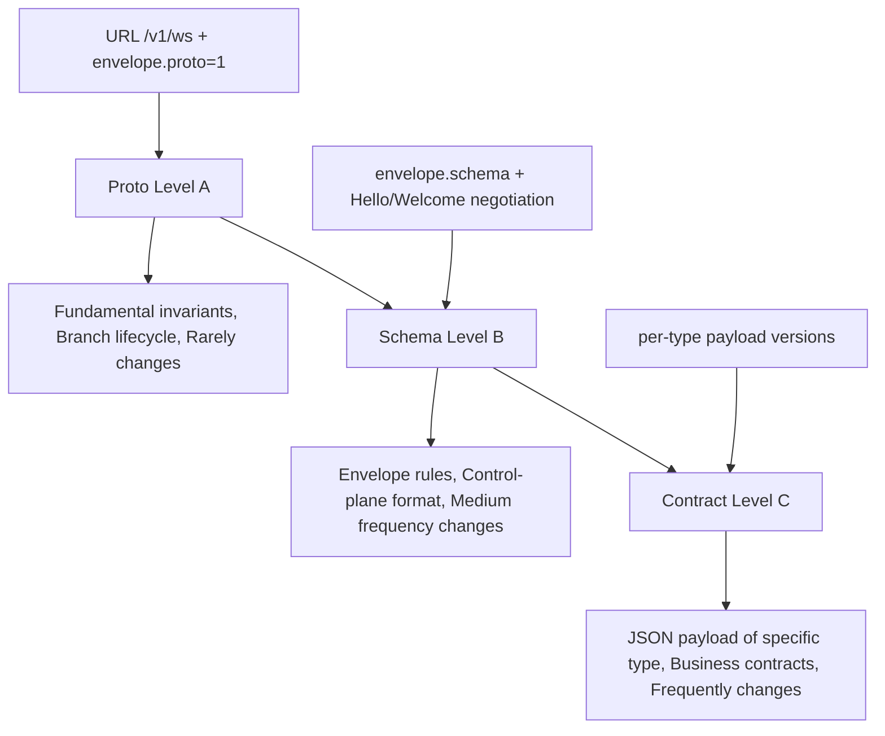
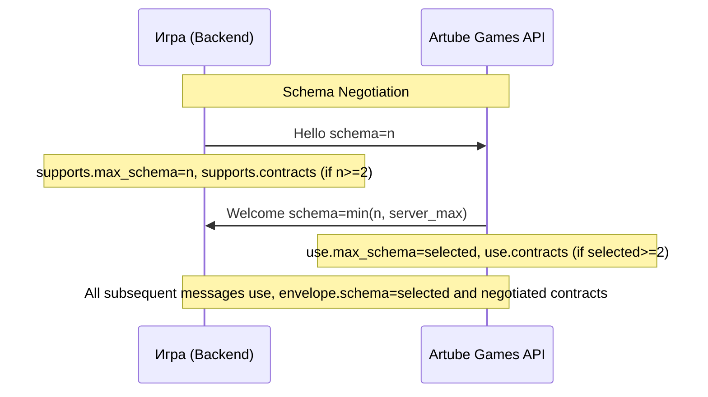
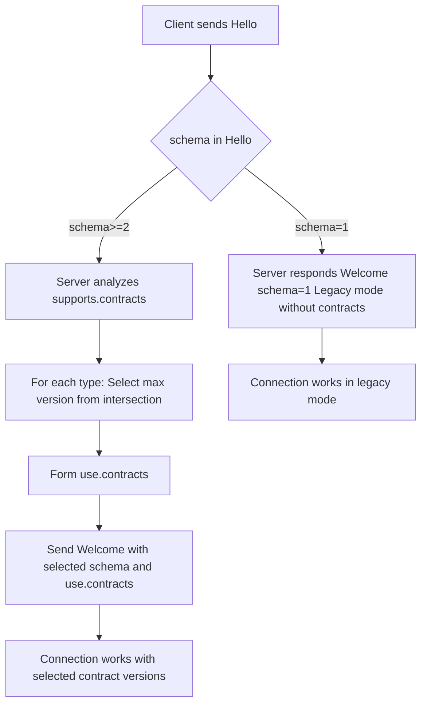
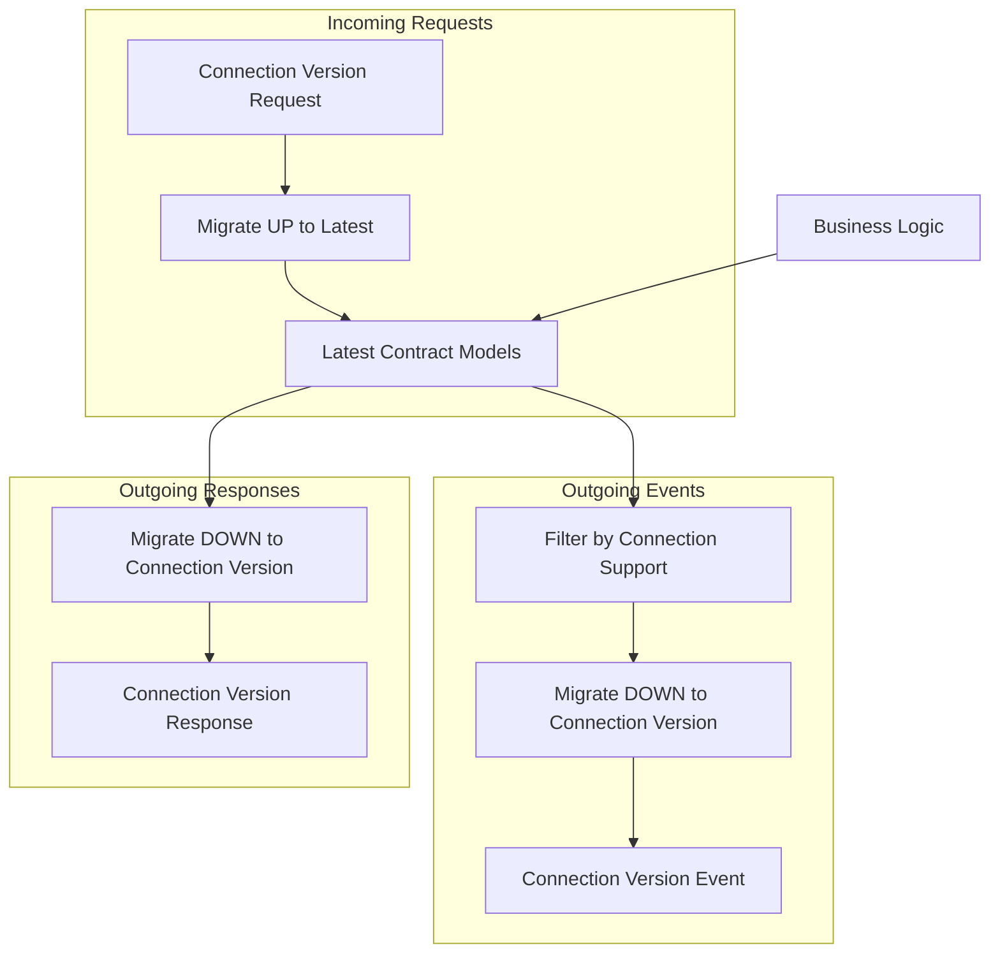

<!-- Source: https://docs.artube-888.live/ru/games-api-integration/protocol/versioning/ -->

# Версионирование

## Обзор системы версионирования

Artube Games API использует трёхуровневую систему версионирования для обеспечения обратной совместимости и плавного обновления интерфейсов. Это позволяет развивать API без нарушения работы существующих игр.

## Анализ текущего состояния

### Текущий протокол:

- URL: `/v1/ws` с `envelope.proto=1`
- Envelope с фиксированными полями: `proto=1, schema=1`

## Трехуровневая модель версионирования

| Уровень | Как обозначается | Что меняется | Примечания |
| --- | --- | --- | --- |
| **A. Proto (major взаимодействия)** | URL `/v1/ws` + `envelope.proto=1` | фундаментальные инварианты взаимодействия и жизненный цикл ветки | редко меняется |
| **B. Schema (каркас протокола)** | `envelope.schema` + выбор через `Hello/Welcome supports/use.max_schema` | правила envelope + control-plane (формат Hello/Welcome/GoAway и т.п.) | меняется редко/средне |
| **C. Версии бизнес-контрактов (по каждому type)** | только через **Hello/Welcome**: `supports.contracts → use.contracts` (новое в schema≥2) | строгое JSON-представление `payload` конкретного `type` | меняется часто |

**Ключевая идея:** type остаётся единым и стабильным на годы, а версия payload для этого type выбирается на соединение через Welcome.use.contracts[type].

## Эволюция схемы (общий принцип schema n → schema n+1)

### Принцип обратной совместимости

- Сервер всегда поддерживает несколько версий schema одновременно
- Клиент объявляет максимальную поддерживаемую версию в Hello
- Сервер выбирает минимум из своего максимума и максимума клиента
- Новые поля добавляются опционально, старые не удаляются в рамках одной schema

### Negotiation Algorithm

## Механизм работы с версиями

### Принцип работы бизнес-логики

### Ключевые принципы

- Вся бизнес-логика работает только с Latest версиями контрактов
- **Запросы (Requests)**: Connection Version → Migrate UP → Latest → обработка
- **Ответы (Responses)**: Latest → Migrate DOWN → Connection Version → отправка
- **События (Events)**: Latest → фильтрация по поддержке → Migrate DOWN → отправка

## Связанные разделы

- **[Конверт](envelope.md)** - структура сообщений с версионированием
- **[Сериализация](serialization.md)** - форматы данных
- **[Обработка ошибок](error-handling.md)** - ошибки версионирования
