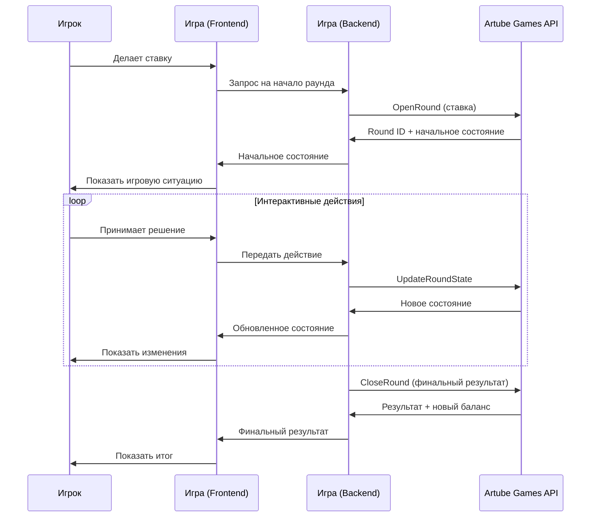

<!-- Source: https://docs.artube-888.live/ru/integration-process/games-api/complex-round/ -->

# Сложный раунд

## Обзор сложного раунда

Сложный раунд - это игровой цикл с интерактивными элементами, где игрок принимает решения во время раунда. Используется последовательность операций: [`OpenRound`](../../games-api-integration/game-requests/open-round.md) → [`UpdateRoundState`](../../games-api-integration/game-requests/update-round-state.md) (множественно) → [`CloseRound`](../../games-api-integration/game-requests/close-round.md).

## Схема сложного раунда



## Характеристики сложного раунда

### ✅ Подходит для:

- **Покер** - выбор карт, решения по ставкам (fold/call/raise)
- **Блэкджек** - решения hit/stand/double/split
- **Слоты с gamble функцией** - выбор между забрать выигрыш или удвоить
- **Слоты с выбором бонуса** - выбор типа бонусной игры
- **Интерактивные слоты** - выбор символов в бонусных раундах
- **Игры с выбором** - “выбери приз”, “угадай карту”, “лестница удачи”
- **Пошаговые игры** - игры с множественными решениями

### ❌ Не подходит для:

- **Простые слоты** - нет интерактива после ставки
- **Рулетка** - решение принимается до запуска
- **Лотереи** - результат мгновенный
- **Краш игры** - только решение о выходе

## Трехэтапная последовательность

### Этап 1: OpenRound - Инициация раунда

```json
{
  "proto": 1,
  "schema": 1,
  "chan": "rpc",
  "type": "OpenRoundRequest",
  "id": "01234567-89ab-cdef-0123-456789abcdef",
  "corr_id": "01234567-89ab-cdef-0123-456789abcdef",
  "op_seq": 12345,
  "timestamp": "2023-01-01T00:00:00.000Z",
  "trace": {
    "traceparent": "00-12345678901234567890123456789012-1234567890123456-01",
    "tracestate": "key1=value1,key2=value2",
    "baggage": "userId=123,sessionId=abc"
  },
  "payload": {
    "session_id": "12345678-1234-5678-9abc-123456789012",
    "price_multiplier": 1.50,    // Множитель размера ставки
    "bet_index": 2,              // Индекс ставки из allowed_bets
    "free_round_campaign_id": "uuid-string", // ID Кампании (опционально)
    "round_state_version": "1.0",
    "round_state": "{\"step\": 1, \"reels\": [1,2,3,4,5], \"bet_level\": 2}"
  }
}
```

#### Ответ OpenRound

```json
{
  "proto": 1,
  "schema": 1,
  "chan": "rpc",
  "type": "OpenRoundResponse",
  "id": "01234567-89ab-cdef-0123-456789abcdef",
  "corr_id": "01234567-89ab-cdef-0123-456789abcdef",
  "op_seq": 12345,
  "timestamp": "2023-01-01T00:00:00.000Z",
  "trace": {
    "traceparent": "00-12345678901234567890123456789012-1234567890123456-01",
    "tracestate": "key1=value1,key2=value2",
    "baggage": "userId=123,sessionId=abc"
  },
  "payload": {
    "round_version": 0,
    "round_id": "87654321-4321-8765-dcba-210987654321",
    "balance": 148.25         // Новый баланс после списания ставки
  }
}
```

### Этап 2: UpdateRoundState - Обновления состояния

```json
{
  "proto": 1,
  "schema": 1,
  "chan": "rpc",
  "type": "UpdateRoundStateRequest",
  "id": "01234567-89ab-cdef-0123-456789abcdef",
  "corr_id": "01234567-89ab-cdef-0123-456789abcdef",
  "op_seq": 12345,
  "timestamp": "2023-01-01T00:00:00.000Z",
  "trace": {
    "traceparent": "00-12345678901234567890123456789012-1234567890123456-01",
    "tracestate": "key1=value1,key2=value2",
    "baggage": "userId=123,sessionId=abc"
  },
  "payload": {
    "session_id": "12345678-1234-5678-9abc-123456789012",
    "round_id": "87654321-4321-8765-dcba-210987654321",
    "round_version": 0,
    "round_state_version": "1.2",
    "round_state": "{\"step\": 3, \"freespins_remaining\": 2, \"current_spin\": 8}"
  }
}
```

#### Ответ UpdateRoundState

```json
{
  "proto": 1,
  "schema": 1,
  "chan": "rpc",
  "type": "UpdateRoundStateResponse",
  "id": "01234567-89ab-cdef-0123-456789abcdef",
  "corr_id": "01234567-89ab-cdef-0123-456789abcdef",
  "op_seq": 12345,
  "timestamp": "2023-01-01T00:00:00.000Z",
  "trace": {
    "traceparent": "00-12345678901234567890123456789012-1234567890123456-01",
    "tracestate": "key1=value1,key2=value2",
    "baggage": "userId=123,sessionId=abc"
  },
  "payload": {
    "round_version": 1
  }
}
```

### Этап 3: CloseRound - Завершение раунда

```json
{
  "proto": 1,
  "schema": 1,
  "chan": "rpc",
  "type": "CloseRoundRequest",
  "id": "01234567-89ab-cdef-0123-456789abcdef",
  "corr_id": "01234567-89ab-cdef-0123-456789abcdef",
  "op_seq": 12345,
  "timestamp": "2023-01-01T00:00:00.000Z",
  "trace": {
    "traceparent": "00-12345678901234567890123456789012-1234567890123456-01",
    "tracestate": "key1=value1,key2=value2",
    "baggage": "userId=123,sessionId=abc"
  },
  "payload": {
    "session_id": "12345678-1234-5678-9abc-123456789012",
    "round_id": "87654321-4321-8765-dcba-210987654321",
    "win_multiplier": 4.00,              // Финальный множитель выигрыша
    "status": "completed",               // completed | cancelled
    "features": [                        // Активированные игровые функции
      {
        "type": "PlayedGamble"
      }
    ],
    "round_version": 1,
    "round_state_version": "1.3",
    "round_state": "{\"step\": 4, \"final_result\": \"completed\", \"total_win_multiplier\": 4.00}"
  }
}
```

#### Ответ CloseRound

```json
{
  "proto": 1,
  "schema": 1,
  "chan": "rpc",
  "type": "CloseRoundResponse",
  "id": "01234567-89ab-cdef-0123-456789abcdef",
  "corr_id": "01234567-89ab-cdef-0123-456789abcdef",
  "op_seq": 12345,
  "timestamp": "2023-01-01T00:00:00.000Z",
  "trace": {
    "traceparent": "00-12345678901234567890123456789012-1234567890123456-01",
    "tracestate": "key1=value1,key2=value2",
    "baggage": "userId=123,sessionId=abc"
  },
  "payload": {
    "balance": 163.75,                   // Финальный баланс после закрытия раунда
    "free_round_campaign": {             // Актуальное состояние Free Round Campaign (опционально)
      "rounds_left": 5,
      "total_win": 10.00,
      "is_complete": false
    }
  }
}
```

> Осторожно
>
>   Стоит обратить внимание на последовательность операций над раундом, которая передаётся полем `round_version`. Бэкенд игры получит его от Games API и обязан его передавать в запросах в которых данное поле обязательно. Высчитывается данное поле строго на стороне Games API.
> Полный цикл: `OpenRoundResponse (round_version=0)` → `UpdateRoundStateRequest(round_version=0)` → `UpdateRoundStateResponse(round_version=1)` → `CloseRoundRequest(round_version=1)`

## Примеры реализации

Детальные примеры реализации различных типов интерактивных игр:

### 🎰 Слоты с интерактивом

- **[Бонусный раунд](complex-round/examples/slot-bonus.md)** - выбор скрытых призов
- **[Gamble функция](complex-round/examples/gamble-accept.md)** - удвоение выигрыша
- **[Выбор бонуса](complex-round/examples/bonus-selection.md)** - выбор типа бонусной игры

### 🔄 Обработка ошибок

- **[Восстановление ошибок](complex-round/examples/error-recovery.md)** - обработка разрывов соединения

## Дополнительные возможности

Сложные раунды поддерживают расширенные функции для создания полноценных интерактивных игр:

### 🔧 Управление состоянием

- **Версионирование состояний** - отслеживание изменений и откат при ошибках
- **Валидация переходов** - проверка корректности смены фаз игры
- **Синхронизация** - поддержание консистентности между клиентом и сервером

### ⚡ Обработка ошибок

- **Автозакрытие раундов** - автоматическое завершение при таймаутах ([Autoclose](../../features/autoclose.md))
- **Восстановление состояния** - продолжение прерванных раундов
- **Graceful degradation** - корректная работа при сбоях

### 📊 Мониторинг и логирование

- **Отслеживание переходов** - полная история действий игрока
- **Метрики производительности** - анализ времени ответов API
- **Обнаружение аномалий** - выявление подозрительной активности

## Разделы документации

### 🎮 Игровые сценарии

Конкретные примеры интерактивных игр и их реализация.

→ [Изучить сценарии](complex-round/game-scenarios.md)

> Заметка
>
> **Внутренняя специфика:** Сложные раунды автоматически закрываются при длительной неактивности.

> Совет
>
> Сложные раунды требуют тщательного планирования состояний. Создайте диаграмму переходов состояний перед началом реализации.

## Связанные разделы

- **[Простой раунд](simple-round.md)** - для игр без интерактива
- **[Общий поток](general-flow.md)** - полная схема взаимодействия
- **[Примеры сложных раундов](../../games-api-integration/examples/complex-round-examples.md)** - детальные сценарии
