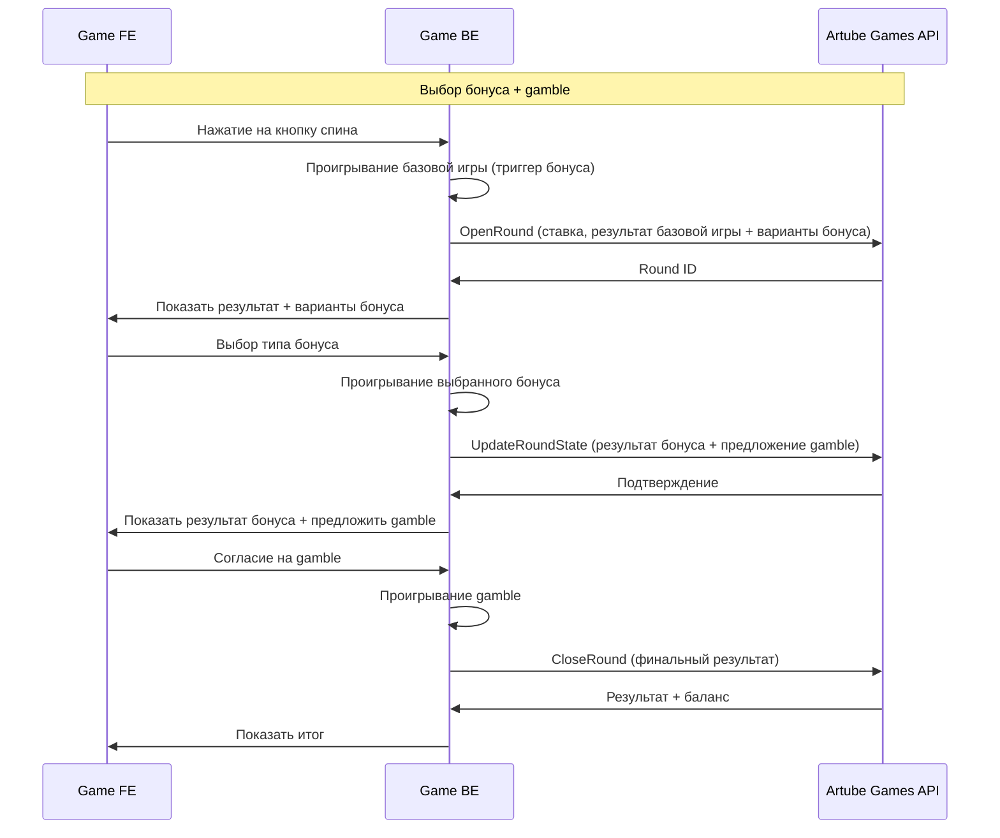

<!-- Source: https://docs.artube-888.live/ru/integration-process/games-api/complex-round/examples/bonus-selection/ -->

# Выбор бонуса

## Слот с выбором бонуса

Интерактивный слот, где игрок может выбрать между разными типами бонусных игр с различными характеристиками RTP и волатильности.

### Схема процесса

### Пошаговая реализация

1. **OpenRound** - Открытие раунда и триггер бонуса

   - Резервируем средства игрока
   - Определяем активацию бонусной игры (например, 3 BONUS символа)
   - Сохраняем промежуточное состояние в API
   - Показываем результат основного спина
   - Предлагаем выбор между типами бонуса:

      - **Wild Storm**: RTP 96.8%, Высокая волатильность, 10 фриспинов
      - **Steady Wins**: RTP 96.5%, Средняя волатильность, 15 фриспинов
2. **Выбор типа бонуса**

   - Игрок анализирует предложенные варианты
   - Выбирает подходящий тип бонуса
   - Фиксируем выбор бонуса в API
3. **UpdateRoundState - Результат бонусной игры**

   - Запускаем выбранный тип бонуса
   - Играем все фриспины с соответствующими характеристиками
   - Рассчитываем общий выигрыш от бонуса
   - **ВАЖНО:** Отправляем UpdateRoundState в Artube Games API с результатом бонуса
4. **Предложение gamble**

   - Предлагаем удвоить выигрыш от бонуса
   - Игрок принимает решение о финальном gamble
   - Обрабатываем выбор цвета карты
   - **ВАЖНО:** Отправляем UpdateRoundState в Artube Games API с выбором gamble
5. **Проигрывание логики gamble (локально)**

   - Генерируем карту для gamble
   - Определяем результат удвоения
   - Рассчитываем финальный выигрыш
6. **CloseRound** - Закрытие раунда с итоговым результатом

   - Применяем финальный выигрыш (бонус + gamble)
   - Сохраняем статистику по типу бонуса и RTP
   - Уведомляем игрока о завершении

## Особенности реализации

**Используемые API вызовы:**

- `OpenRoundRequest` - открытие раунда
- `UpdateRoundStateRequest` - **КРИТИЧЕСКИ ВАЖНО:** отправляется в Artube Games API множественно для сохранения каждого этапа взаимодействия
- `CloseRoundRequest` - финальный расчет

**Важность UpdateRoundState:**

1. Результат базовой игры + варианты бонуса сохраняются в API
2. Выбор типа бонуса игроком фиксируется в API
3. Результат бонусной игры сохраняется в API
4. Выбор gamble игроком фиксируется в API

> Заметка
>
>   Также не забывайте, что, несмотря на то, что каждая из операций `OpenRound/CloseRound` сохраняет `round_state`, состояние всё равно необходимо сохранять перед каждым выбором игрока с помощью вызова `UpdateRoundState`.

**Управление состоянием:**

- `"betting"` → `"bonus_selection"` → `"bonus_playing"` → `"gamble_offered"` → `"gamble_completed"` → `"completed"`

**Типы бонусов:**

- **Wild Storm**: Редкие большие выигрыши, высокий RTP
- **Steady Wins**: Частые средние выигрыши, стабильный RTP

**Валидация:**

- Бонус доступен только при соответствующих символах
- Gamble доступен только при выигрыше от бонуса
- Все расчеты производятся на бэкенде игры
- Каждое решение игрока сохраняется в Artube Games API

> Осторожно
>
>   Так как все расчёты производятся на бэкенде игры, логика бэкенда должна быть максимально отказоустойчивой.

## Связанные разделы

- **[Игровые сценарии](../game-scenarios.md)** - обзор всех сценариев
- **[UpdateRoundState](../../../../games-api-integration/game-requests/update-round-state.md)** - API документация
