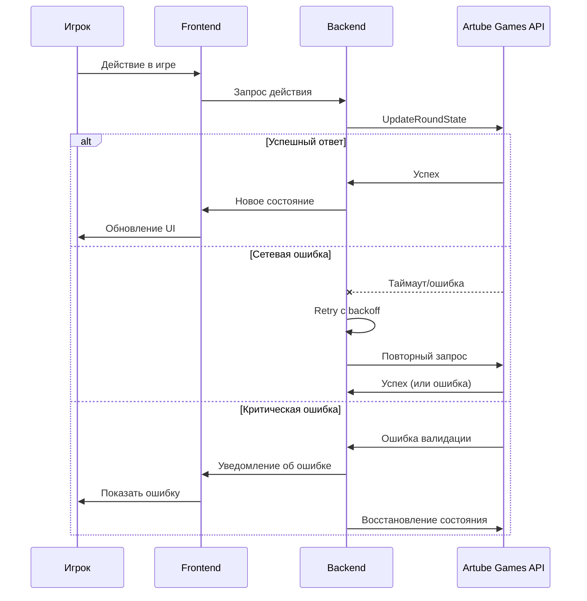

<!-- Source: https://docs.artube-888.live/ru/integration-process/games-api/complex-round/examples/error-recovery/ -->

# Обработка ошибок и восстановление

## Обработка ошибок и восстановление состояния

Правильные паттерны обработки сетевых ошибок, таймаутов и восстановления прерванных раундов в интерактивных играх.

### Схема обработки ошибок



### Пошаговая обработка ошибок

1. **Обнаружение ошибки**

   - Отслеживаем таймауты запросов (рекомендуется 30 секунд)
   - Проверяем статусы ответов API (4xx, 5xx)
   - Мониторим разрывы WebSocket соединения
   - Логируем все ошибки с контекстом
2. **Классификация типа ошибки**

   - **Временные** - сетевые сбои, таймауты (retry)
   - **Бизнес-логика** - нарушение правил игры (показать пользователю)
   - **Валидационные/критические** - системные сбои (восстановление состояния)
3. **Стратегия повторных попыток**

   - Exponential backoff с максимальными интервалами 1s, 2s, 4s, 8s
   - Максимум 3-5 попыток для временных ошибок
   - Jitter для предотвращения thundering herd
   - Разные стратегии для разных типов запросов
4. **Кэширование состояния**

   - Сохраняем последнее валидное состояние локально
   - Кэшируем все отправленные, но не подтвержденные запросы
   - Ведем локальную историю действий игрока
   - Используем optimistic updates для UI
5. **Обработка разрыва соединения**

   - Автоматическое переподключение WebSocket
   - Проверка состояния сессии при восстановлении
   - Синхронизация с сервером после переподключения
   - Уведомление игрока о статусе соединения
6. **Восстановление состояния**

   - Запрашиваем актуальное состояние раунда
   - Восстанавливаем состояние на основе последних данных
   - Сверяем локальное состояние с серверным
   - Решаем конфликты в пользу сервера
7. **Graceful degradation**

   - Показываем загрузочные состояния при задержках
   - Отключаем интерактивные элементы во время ошибок
   - Предоставляем альтернативные пути действий
   - Сохраняем прогресс игрока максимально возможно

## Типы ошибок и реакции

### Ошибки валидации

```json
{
  "proto": 1,
  "schema": 1,
  "chan": "rpc",
  "type": "Error",
  "id": "01234567-89ab-cdef-0123-456789abcdef",
  "corr_id": "01234567-89ab-cdef-0123-456789abcdef",
  "op_seq": 12346,
  "timestamp": "2023-01-01T00:00:01.000Z",
  "payload": {
    "code": "BadRequest",
    "message": "invalid json",
    "details": {}
  }
}
```

### Недостаточный баланс

```json
{
  "proto": 1,
  "schema": 1,
  "chan": "rpc",
  "type": "Error",
  "id": "01234567-89ab-cdef-0123-456789abcdef",
  "corr_id": "01234567-89ab-cdef-0123-456789abcdef",
  "op_seq": 12347,
  "timestamp": "2023-01-01T00:00:02.000Z",
  "payload": {
    "code": "InsufficientFunds",
    "message": "Unable to process the transaction for the round.",
    "details": {}
  }
}
```

### Неверная операция над раундом

```json
{
  "proto": 1,
  "schema": 1,
  "chan": "rpc",
  "type": "Error",
  "id": "01234567-89ab-cdef-0123-456789abcdef",
  "corr_id": "01234567-89ab-cdef-0123-456789abcdef",
  "op_seq": 12348,
  "timestamp": "2023-01-01T00:00:03.000Z",
  "payload": {
    "code": "InvalidRoundOperation",
    "message": "Round is already opened.",
    "details": {}
  }
}
```

### Системные ошибки

```json
{
  "proto": 1,
  "schema": 1,
  "chan": "rpc",
  "type": "Error",
  "id": "01234567-89ab-cdef-0123-456789abcdef",
  "corr_id": "01234567-89ab-cdef-0123-456789abcdef",
  "op_seq": 12349,
  "timestamp": "2023-01-01T00:00:04.000Z",
  "payload": {
    "code": "InternalServerError",
    "message": "Failed to process the request.",
    "details": {}
  }
}
```

### Недействительная сессия

```json
{
  "proto": 1,
  "schema": 1,
  "chan": "rpc",
  "type": "Error",
  "id": "01234567-89ab-cdef-0123-456789abcdef",
  "corr_id": "01234567-89ab-cdef-0123-456789abcdef",
  "op_seq": 12350,
  "timestamp": "2023-01-01T00:00:05.000Z",
  "payload": {
    "code": "SessionInvalid",
    "message": "The session is invalid or cannot be retrieved",
    "details": {}
  }
}
```

## Стратегии обработки по типам ошибок

**Сетевые ошибки (retry):**

- Exponential backoff: 1s, 2s, 4s, 8s
- Максимум 3-5 попыток
- Jitter для предотвращения thundering herd

**Ошибки валидации (восстановление):**

- Проверить корректность данных запроса
- Исправить некорректные поля
- Показать пользователю понятное сообщение

**Системные ошибки (восстановление):**

- Повторить запрос через указанное время
- Восстановить состояние из кэша
- Уведомить пользователя о проблеме

**Ошибки сессии (переподключение):**

- Создать новую сессию
- Восстановить состояние игры
- Продолжить с последнего сохраненного состояния

## Паттерны восстановления состояния

**Локальное кэширование:**

- Сохраняем состояние после каждого успешного UpdateRoundState
- Используем localStorage/sessionStorage для персистентности
- Очищаем кэш только после успешного CloseRound
- Восстанавливаем UI из кэша при перезагрузке страницы

**Optimistic Updates:**

- Обновляем UI немедленно после действия игрока
- Откатываем изменения при получении ошибки
- Показываем индикаторы “pending” для неподтвержденных действий
- Блокируем повторные действия до подтверждения

**Синхронизация с сервером:**

- Периодически проверяем актуальность локального состояния
- Используем версионирование состояний для обнаружения конфликтов
- Автоматически синхронизируемся при восстановлении соединения
- Приоритет всегда у серверной версии состояния

## Пользовательский опыт при ошибках

**Информативные сообщения:**

- “Соединение временно прервано, восстанавливаем…”
- “Ваш ход обрабатывается, пожалуйста подождите”
- “Раунд восстановлен с последнего сохраненного состояния”
- “Время на принятие решения истекло, раунд завершен автоматически”

**Визуальные индикаторы:**

- Спиннеры загрузки для длительных операций
- Цветовая индикация статуса соединения
- Отключение кнопок во время обработки ошибок
- Анимации для восстановления состояния

**Fallback опции:**

- Кнопка “Обновить” для принудительной синхронизации
- Возможность связаться с поддержкой из игры
- Сохранение скриншота состояния для расследования
- Опция завершить раунд принудительно (если доступно)

> Осторожно
>
> **Важно:** Никогда не доверяйте только клиентскому состоянию. Сервер всегда является источником истины, особенно для финансовых операций.

## Мониторинг и алертинг

**Метрики для отслеживания:**

- Процент успешных запросов к API
- Среднее время ответа UpdateRoundState
- Количество прерванных раундов

**Алерты на критические ситуации:**

- Увеличение количества таймаутов > 5%
- Рост количества системных ошибок
- Массовые разрывы соединений
- Аномально долгие раунды (> 1 часа)

## Связанные разделы

- **[Обработка ошибок](../../../../games-api-integration/protocol/error-handling.md)** - общие принципы
