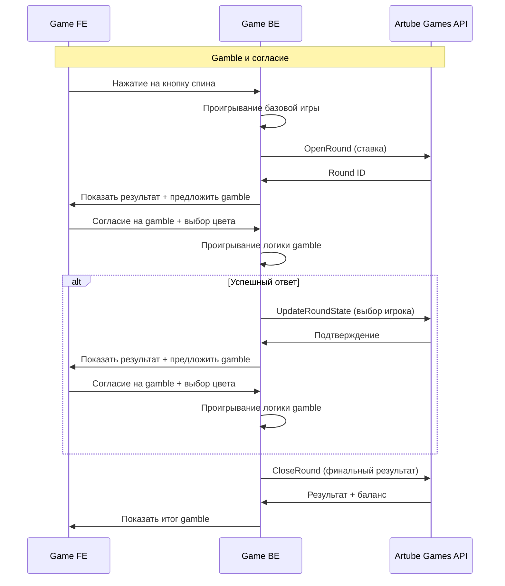

<!-- Source: https://docs.artube-888.live/ru/integration-process/games-api/complex-round/examples/gamble-accept/ -->

# Gamble с согласием

## Слот с функцией Gamble (согласие)

Интерактивный слот, где после выигрыша игрок соглашается на gamble и пытается удвоить выигрыш.

### Схема процесса

### Пошаговая реализация

1. **Проигрывание базовой игры**

   - Генерируем результат основного спина на backend
   - Определяем выигрышные линии и базовый выигрыш
   - Проверяем возможность активации gamble
2. **OpenRound** - Открываем раунд с начальной ставкой

   - Резервируем средства игрока
   - Создаем round_id для отслеживания
   - Устанавливаем начальное состояние игры
3. **Проигрывание логики gamble (локально)**

   - Генерируем случайную карту на backend
   - Сравниваем цвет карты с выбором игрока
   - Определяем результат: удвоение или потеря выигрыша
4. **UpdateRoundState** - Необходим, если дальше будет снова запрос на gamble после шага 3

   - Игрок соглашается попытаться удвоить выигрыш
   - Предлагаем выбор цвета карты (красная/черная)
   - **ВАЖНО:** Отправляем UpdateRoundState в Artube Games API с выбором игрока
   - Фиксируем выбор игрока в API
5. **CloseRound** - Закрытие раунда с финальным результатом

   - Применяем финальный выигрыш к балансу
   - Сохраняем результат gamble в истории
   - Уведомляем игрока о результате

## Особенности реализации

**Используемые API вызовы:**

- `OpenRoundRequest` - для резервирования ставки
- `UpdateRoundStateRequest` - **КРИТИЧЕСКИ ВАЖНО:** отправляется в Artube Games API для сохранения каждого промежуточного состояния, требующего выбора **пользователя**
- `CloseRoundRequest` - для финального расчета

**Важность UpdateRoundState:**

- Результат базовой игры ОБЯЗАТЕЛЬНО сохраняется в Artube Games API
- Выбор игрока для gamble сохраняется в API
- Позволяет восстановить точное состояние игры при разрыве соединения
- Обеспечивает честность игрового процесса

> Заметка
>
>   Также не забывайте, что несмотря на то, что каждая из операций `OpenRound/CloseRound` сохраняет `round_state`, состояние перед каждым выбором игрока нужно сохранять вызовом `UpdateRoundState`.

**Управление состоянием:**

- `game_phase: "betting"` → `"base_completed"` → `"gamble_offered"` → `"gamble_completed"` → `"completed"`
- Версионирование состояния: `1.0` → `1.1` → `1.2` → `1.3` → `1.4`

**Валидация переходов:**

- Gamble доступен только при наличии базового выигрыша
- Игрок может выбрать только “red” или “black”
- Результат gamble определяется на backend для безопасности

> Осторожно
>
>   Так как все расчёты производятся на бэкенде игры, логика бэкенда должна быть максимально отказоустойчивой.

## Связанные разделы

- **[Игровые сценарии](../game-scenarios.md)** - обзор всех сценариев
- **[Gamble с отказом](gamble-decline.md)** - альтернативный сценарий
- **[OpenRound](../../../../games-api-integration/game-requests/open-round.md)** - API документация
