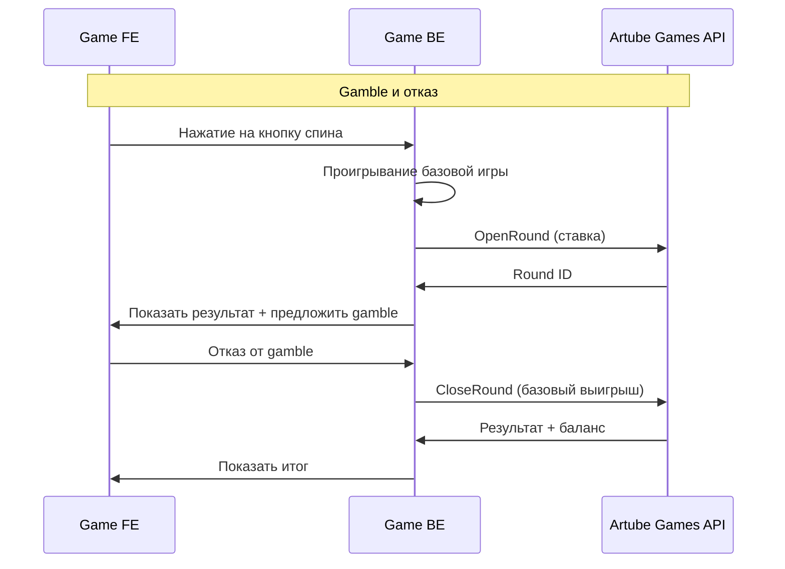

<!-- Source: https://docs.artube-888.live/ru/integration-process/games-api/complex-round/examples/gamble-decline/ -->

# Gamble с отказом

## Слот с Gamble функцией (отказ)

Интерактивный слот, где после выигрыша игрок отказывается от gamble и забирает базовый выигрыш.

### Схема процесса

### Пошаговая реализация

1. **Проигрывание базовой игры**

   - Генерируем результат основного спина на backend
   - Определяем выигрышные линии и базовый выигрыш
   - Проверяем возможность активации gamble
2. **OpenRound** - Открываем раунд с базовым результатом

   - Резервируем средства игрока
   - Создаем round_id для отслеживания
   - Устанавливаем начальное состояние игры, до gamble
3. **CloseRound** - Получение отказа от gamble и закрытие раунда с базовым выигрышем

   - Игрок отказывается от риска и выбирает забрать выигрыш
   - Применяем базовый выигрыш к балансу (без удвоения)
   - Сохраняем информацию об отказе от gamble
   - Уведомляем игрока о получении базового выигрыша

## Особенности реализации

**Используемые API вызовы:**

- `OpenRoundRequest` - для резервирования ставки  **КРИТИЧЕСКИ ВАЖНО:** отправляется в Artube Games API для сохранения результата базовой игры и отказа от gamble
- `CloseRoundRequest` - для применения базового выигрыша

> Заметка
>
>   Также не забывайте что не смотря на то что каждая из операций `OpenRound/CloseRound` сохраняет `round_state`, тем не менее нужно сохранять состояние перед каждым выбором игрока вызовом `UpdateRoundState`

**Управление состоянием:**

- `game_phase: "betting"` → `"base_completed"` → `"gamble_declined"` → `"completed"`
- Не требует UpdateRoundState CloseRound фиксируется результат и отказ от gamble

**Отличия от согласия:**

- Меньше промежуточных состояний
- Выигрыш остается базовым (не удваивается)

## Связанные разделы

- **[Игровые сценарии](../game-scenarios.md)** - обзор всех сценариев
- **[Gamble с согласием](gamble-accept.md)** - альтернативный сценарий
- **[CloseRound](../../../../games-api-integration/game-requests/close-round.md)** - API документация
