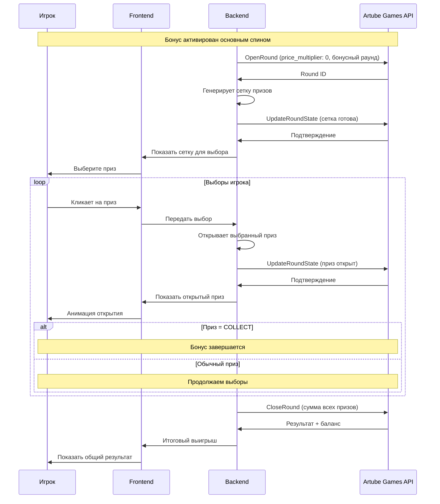

<!-- Source: https://docs.artube-888.live/ru/integration-process/games-api/complex-round/examples/slot-bonus/ -->

# Бонусный раунд слота

## Интерактивный бонусный раунд слота

Реализация бонусного раунда типа “выбери приз”, где игрок делает выборы среди скрытых призов до получения символа “COLLECT”.

### Схема процесса



### Пошаговая реализация

1. **OpenRound - Инициация бонусного раунда**

   - Отправляем запрос с `price_multiplier: 0` (бонус бесплатный)
   - Указываем тип бонуса “pick_prizes”
   - Устанавливаем количество доступных выборов
   - Получаем Round ID для отслеживания
2. **Генерация сетки призов**

   - Создаем скрытую сетку призов (например, 3×4)
   - Размещаем денежные призы и символы “COLLECT”
   - Определяем мультипликаторы базовой ставки
   - Инициализируем состояние бонуса
3. **UpdateRoundState - Готовность к выбору**

   - Формируем состояние «pick_prizes», в котором игроку доступны выборы
   - **ВАЖНО:** Отправляем UpdateRoundState в Artube Games API для сохранения состояния
   - Показываем игроку сетку закрытых призов после подтверждения API
   - Указываем количество оставшихся выборов
   - Активируем интерфейс для выбора
4. **Обработка выбора игрока (локально)**

   - Получаем позицию выбранного приза
   - Открываем скрытый приз на этой позиции
   - Добавляем значение к текущему выигрышу
   - Уменьшаем количество оставшихся выборов
5. **UpdateRoundState - Приз открыт**

   - Формируем новое состояние с открытым призом
   - Добавляем приз к списку открытых
   - Обновляем текущую сумму выигрыша
   - **ВАЖНО:** Отправляем UpdateRoundState в Artube Games API для сохранения выбора
   - Проверяем условие завершения после подтверждения API
6. **Проверка условий завершения**

   - Если открыт символ “COLLECT” - завершаем бонус
   - Если израсходованы все выборы - завершаем бонус
   - Если открыт специальный символ - применяем эффект
   - Иначе продолжаем выборы
7. **Финализация бонуса**

   - Суммируем все открытые призы
   - Применяем возможные мультипликаторы
   - Формируем финальное состояние бонуса
   - Подготавливаем данные для CloseRound
8. **CloseRound - Завершение бонусного раунда**

   - Отправляем общую сумму выигрыша
   - Указываем статус “completed”
   - Получаем обновленный баланс
   - Показываем игроку итоговый результат

## Структура состояний раунда

**Начальное состояние (после OpenRound):**

```json
{
  "step": 1,
  "bonus_type": "pick_prizes",
  "picks_remaining": 3,
  "total_picks": 3,
  "prizes_revealed": [],
  "current_win": 0,
  "base_bet": 10.00
}
```

**После каждого выбора:**

```json
{
  "step": 2,
  "bonus_type": "pick_prizes",
  "picks_remaining": 2,
  "prizes_revealed": [
    {"position": 5, "prize": {"type": "money", "value": 50.00}}
  ],
  "current_win": 50.00,
  "last_pick": {"position": 5, "prize": {"type": "money", "value": 50.00}}
}
```

**Финальное состояние:**

```json
{
  "step": 4,
  "bonus_type": "pick_prizes",
  "picks_remaining": 0,
  "prizes_revealed": [
    {"position": 5, "prize": {"type": "money", "value": 50.00}},
    {"position": 8, "prize": {"type": "money", "value": 75.00}},
    {"position": 2, "prize": {"type": "collect"}}
  ],
  "current_win": 125.00,
  "bonus_completed": true,
  "total_bonus_win": 125.00
}
```

## Особенности реализации

**Используемые API вызовы:**

- `OpenRound` с `price_multiplier: 0` - создание бесплатного бонусного раунда
- `UpdateRoundState` - **КРИТИЧЕСКИ ВАЖНО:** отправляется в Artube Games API для сохранения каждого состояния и выбора игрока
- `CloseRound` - финализация с суммой всех призов

**Важность UpdateRoundState:**

- Каждый выбор игрока ОБЯЗАТЕЛЬНО сохраняется в Artube Games API
- Позволяет восстановить точное состояние бонусной игры при разрыве соединения
- Предотвращает потерю прогресса игрока в бонусном раунде
- Обеспечивает честность и прозрачность бонусной игры

> Заметка
>
>   Также не забывайте, что, несмотря на то что каждая из операций `OpenRound/CloseRound` сохраняет `round_state`, тем не менее нужно сохранять состояние перед каждым выбором игрока вызовом `UpdateRoundState`.

**Типы призов:**

- **Денежные призы** - фиксированные суммы или мультипликаторы ставки
- **Символ COLLECT** - завершает бонус немедленно
- **Мультипликаторы** - увеличивают текущий выигрыш
- **Дополнительные выборы** — увеличивают количество доступных попыток

**Механики завершения:**

- Открытие символа “COLLECT”
- Исчерпание всех доступных выборов
- Срабатывание специального условия
- Достижение максимального выигрыша

> Совет
>
> При создании сетки призов важно сбалансировать вероятности так, чтобы средний выигрыш соответствовал заданному RTP бонусной функции.

## Вариации бонусных раундов

**“Лестница удачи”:**

- Игрок выбирает направление (вверх/стоп)
- Каждый уровень увеличивает приз
- Риск потерять все при неудачном выборе

**“Колесо фортуны”:**

- Игрок запускает колесо
- Случайная остановка на призе
- Возможность повторных вращений

**“Мини-игра”:**

- Отдельная логика игры внутри бонуса
- Результат зависит от навыков/удачи
- Интеграция через UpdateRoundState

## Связанные разделы

- **[Игровые сценарии](../game-scenarios.md)** - обзор всех сценариев
- **[OpenRound](../../../../games-api-integration/game-requests/open-round.md)** - API документация
- **[UpdateRoundState](../../../../games-api-integration/game-requests/update-round-state.md)** - обновление состояния
- **[CloseRound](../../../../games-api-integration/game-requests/close-round.md)** - завершение раунда
