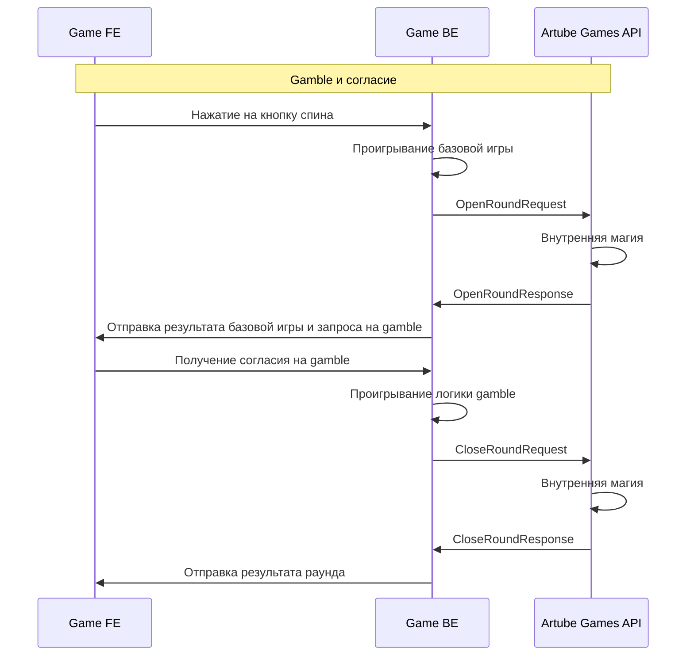
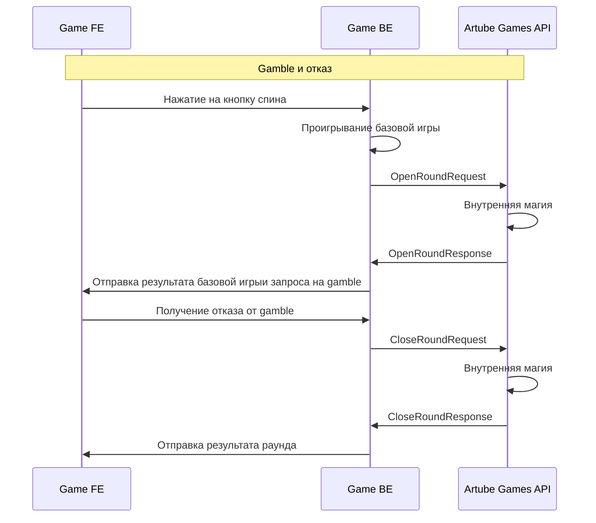
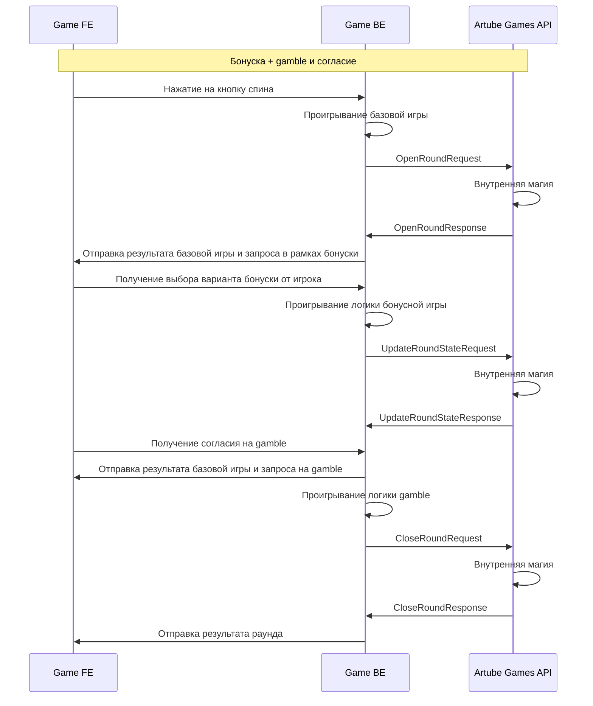
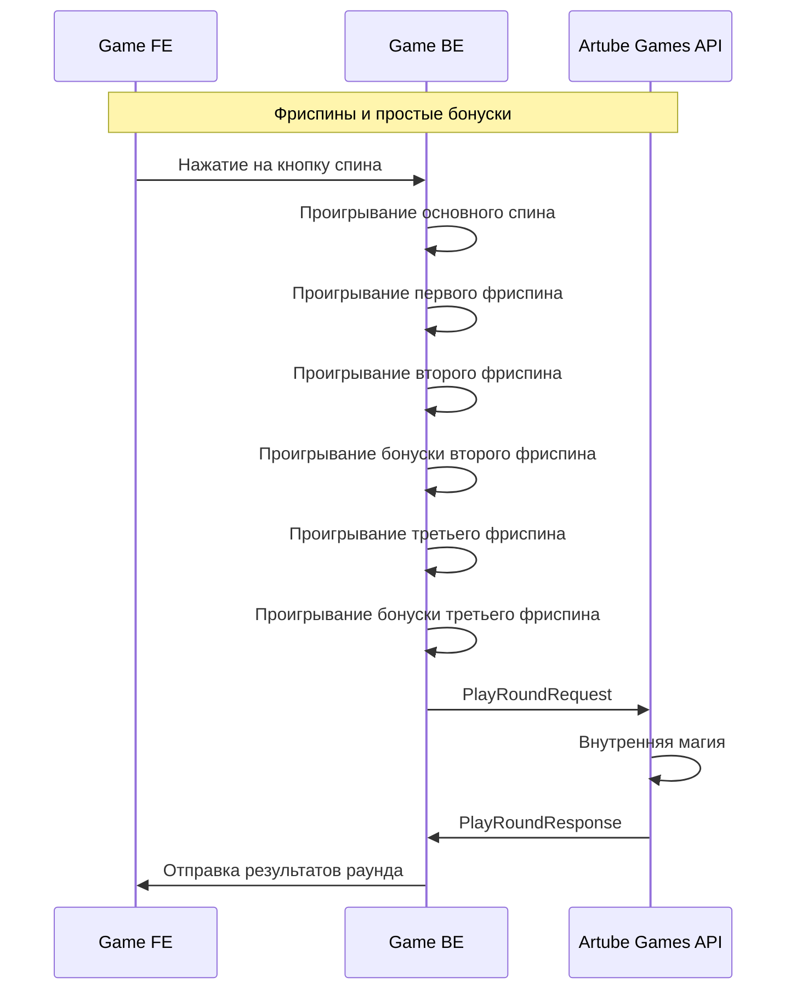
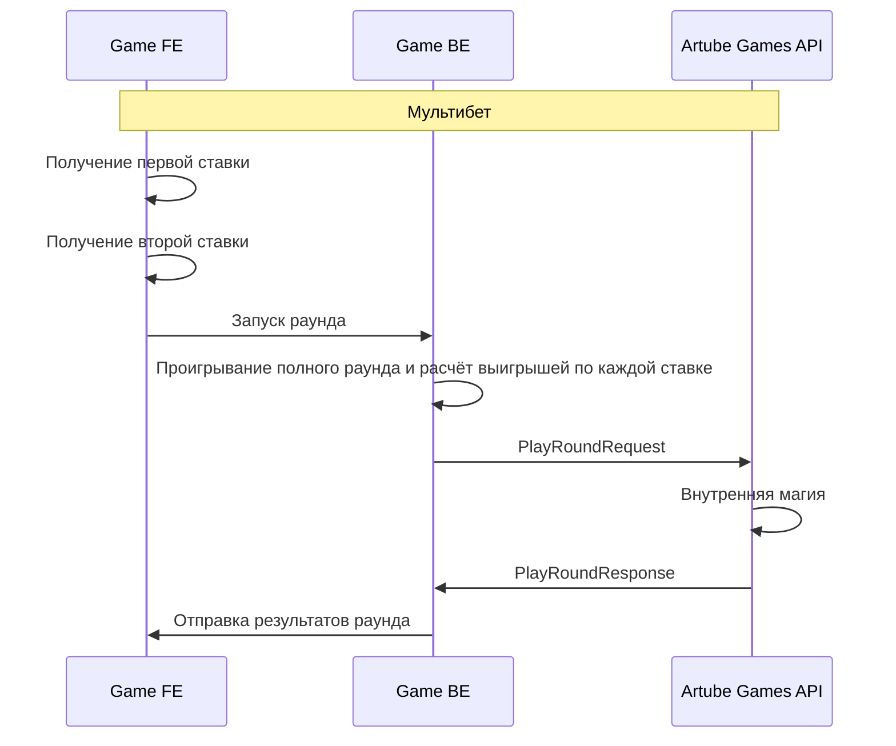
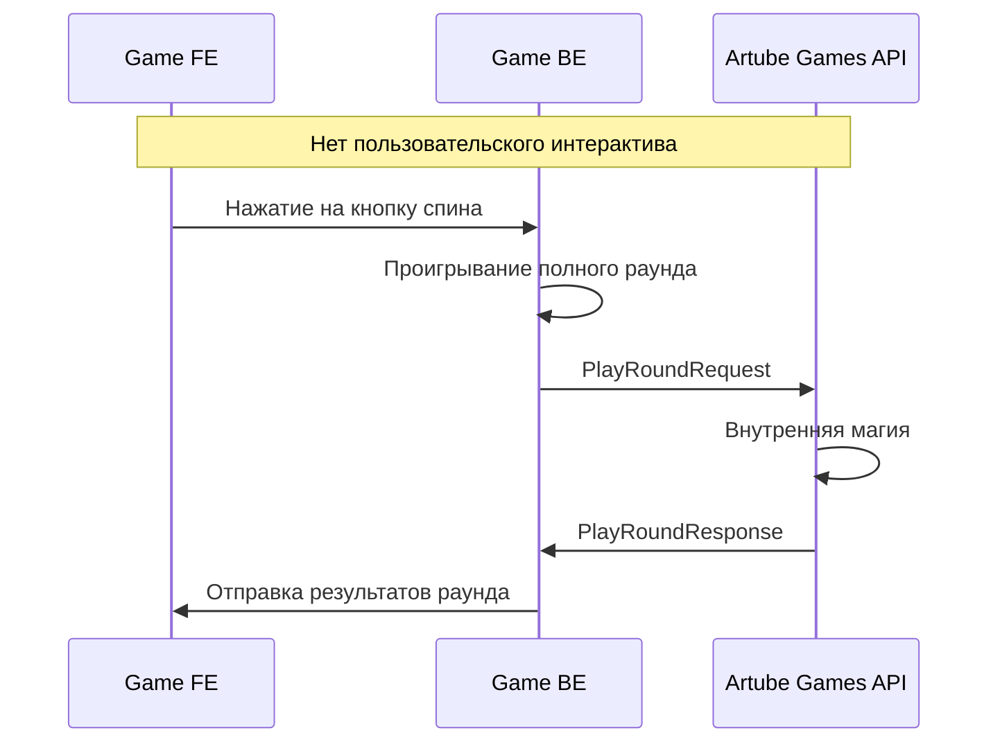
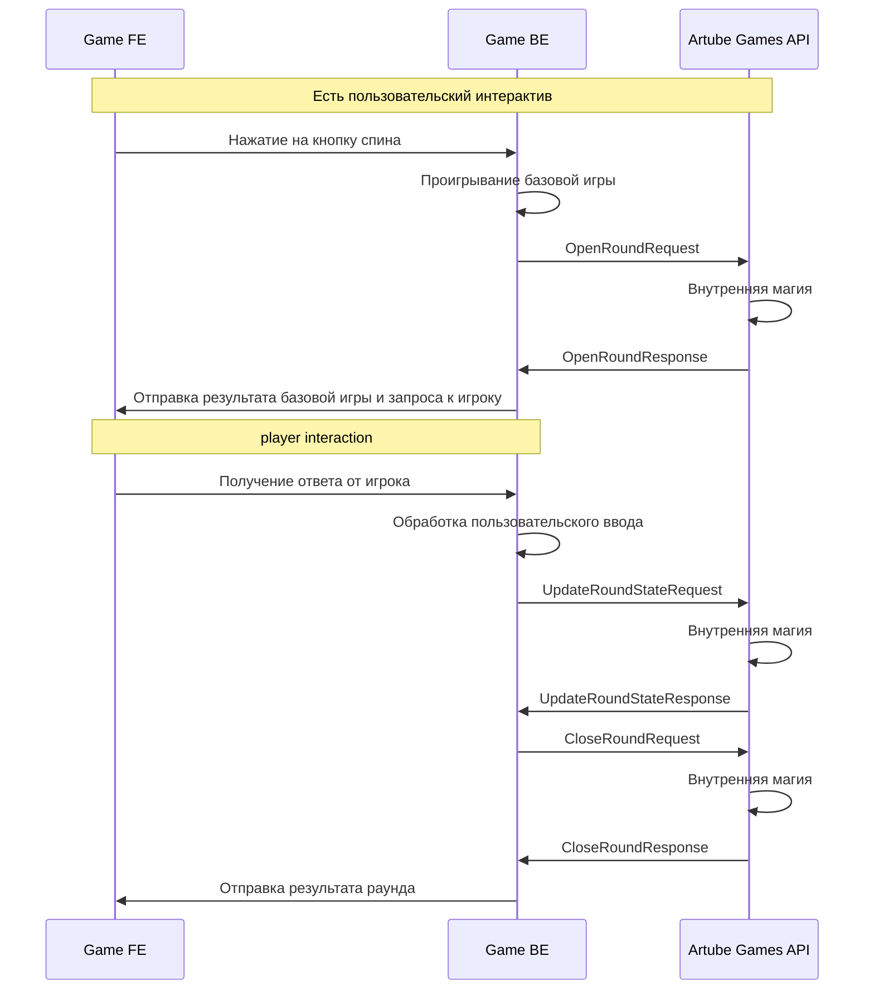

<!-- Source: https://docs.artube-888.live/ru/integration-process/games-api/complex-round/game-scenarios/ -->

# Игровые сценарии - Сложный раунд

## Сценарий 1: Слот с Gamble функцией (согласие)

Интерактивный слот, где после выигрыша игрок соглашается на gamble и удваивает выигрыш.

### Схема Gamble с согласием

### Пошаговая реализация

1. **OpenRound** - Проигрывание базовой игры и генерация результата основного спина, открытие раунда с нужным стейтом
2. **UpdateRoundState** - Отправка результата базовой игры и запроса на gamble игроку
3. **UpdateRoundState** - Получение согласия на gamble и проигрывание логики удвоения
4. **CloseRound** - Закрытие раунда с финальным выигрышем (удвоенным или потерянным)

→ [Полная реализация кода](examples/gamble-accept.md)

## Sценарий 2: Слот с Gamble функцией (отказ)

Интерактивный слот, где после выигрыша игрок отказывается от gamble и забирает выигрыш.

### Схема Gamble с отказом

### Пошаговая реализация

1. **OpenRound** - Проигрывание базовой игры с выигрышем, открытие раунда с начальной ставкой
2. **CloseRound** — Предложение gamble и получение отказа от игрока, закрытие раунда с базовым выигрышем (без удвоения)

→ [Полная реализация кода](examples/gamble-decline.md)

## Сценарий 3: Слот с выбором бонуса

Интерактивный слот, где игрок выбирает тип бонусной игры с разными характеристиками.

### Схема выбора бонуса

### Пошаговая реализация

1. **OpenRound** - Открытие раунда и триггер бонусной игры
2. **UpdateRoundState** - Отправка вариантов бонуса и получение выбора игрока
3. **UpdateRoundState** - Проигрывание выбранного бонуса и расчет выигрыша
4. **UpdateRoundState** - Предложение финального gamble после бонуса
5. **CloseRound** - Закрытие раунда с итоговым результатом (бонус + gamble)

→ [Полная реализация кода](examples/bonus-selection.md)

## Сценарий 4: Фриспины с простыми бонусами

Последовательность фриспинов с различными бонусными механиками.

### Схема фриспинов

### Пошаговая реализация

1. **Внутренняя обработка** - Проигрывание всех фриспинов и бонусов на backend
2. **PlayRound** - Закрытие раунда с общим результатом всех фриспинов

## Сценарий 5: Мультибет (простой)

Обработка нескольких ставок в одном раунде с финальным расчетом.

### Схема мультибета

### Пошаговая реализация

1. **Сбор ставок** - Получение нескольких ставок от игрока через UI
2. **Обработка ставок** - Расчет результатов для каждой ставки отдельно
3. **PlayRound** - Отправка одного запроса с общим результатом всех ставок

## Сценарий 6: Простой слот (без интерактива)

Классический простой слот без пользовательского интерактива.

### Схема простого слота

### Пошаговая реализация

1. **Генерация результата** - Создание результата спина на backend
2. **PlayRound** - Отправка одного запроса с готовым результатом

## Сценарий 7: Интерактивный бонус

Слот с пользовательским интерактивом в бонусной игре.

### Схема интерактивного бонуса

