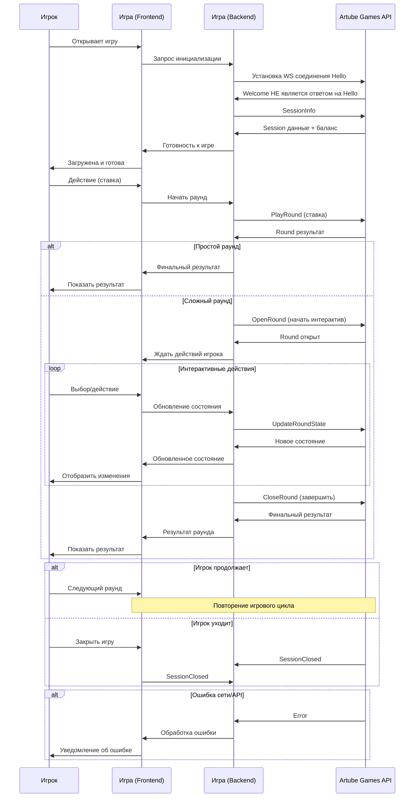

<!-- Source: https://docs.artube-888.live/ru/integration-process/games-api/general-flow/ -->

# Общий поток

## Обзор общего потока

Общий поток игры описывает последовательность событий и сообщений между игрой и Artube Games API от момента подключения игрока до завершения игровой сессии.

## Полная схема игрового потока

## Основные компоненты протокола

### 🔗 Установление соединения

Процесс подключения к платформе и аутентификации.

→ [Изучить подключение](general-flow/connection.md)

### 🎮 Игровые сессии

Управление игровыми сессиями и получение данных игрока.

→ [Сессии](general-flow/sessions.md)

### 🔄 Игровые циклы

Различные типы игровых раундов и их жизненные циклы.

→ [Циклы](general-flow/game-cycles.md)

### ❌ Обработка ошибок

Обработка различных типов ошибок и recovery сценарии.

→ [Ошибки](general-flow/error-handling.md)

## Типы сообщений

### 🔗 Управляющие сообщения

Управляют соединением и базовой коммуникацией:

- **Hello** - инициация соединения, отправка максимально поддерживаемой версии
- **Welcome** - сообщение от Games API с максимально поддерживаемой версией
- **GoAway** - корректное отключение

> Заметка
>
> Так как Hello и Welcome не является Req/Res, Games API при инициализации подключения ожидает сообщение Hello. В случае если оно отсутствует, Games API будет считать что Игра использует актуальные версии

### 🎮 Игровые сообщения

Управляют игровой логикой и раундами:

- **[SessionInfo](../../games-api-integration/game-requests/session-info.md)** - получение данных сессии
- **[PlayRound](../../games-api-integration/game-requests/play-round.md)** - выполнение простого раунда
- **[OpenRound](../../games-api-integration/game-requests/open-round.md)** - начало сложного раунда
- **[UpdateRoundState](../../games-api-integration/game-requests/update-round-state.md)** - обновление состояния
- **[CloseRound](../../games-api-integration/game-requests/close-round.md)** - завершение раунда
- **[AutocloseRound](../../games-api-integration/game-requests/autoclose-round.md)** - запрос на автозакрытие раунда

### 📡 API события

Уведомления от платформы к игре:

- **[SessionClosedEvent](../../games-api-integration/api-requests/session-closed.md)** - сессия завершена
- **[BalanceChangedEvent](../../games-api-integration/api-requests/balance-changed.md)** - изменение баланса
- **[NewConnectionEvent](../../games-api-integration/api-requests/new-connection-event.md)** - новое соединение
- **[AutocloseRequestEvent](../../games-api-integration/api-requests/autoclose-request-event.md)** - запрос на автозакрытие

> Заметка
>
> **Внутренняя специфика:** Все сообщения упаковываются в конверт-протокол с версионированием.

## Связанные разделы

- **[Простой раунд](simple-round.md)** - детальный разбор простого потока
- **[Сложный раунд](complex-round.md)** - интерактивные игры
- **[Транзакционная модель](transaction-model.md)** - финансовые аспекты
