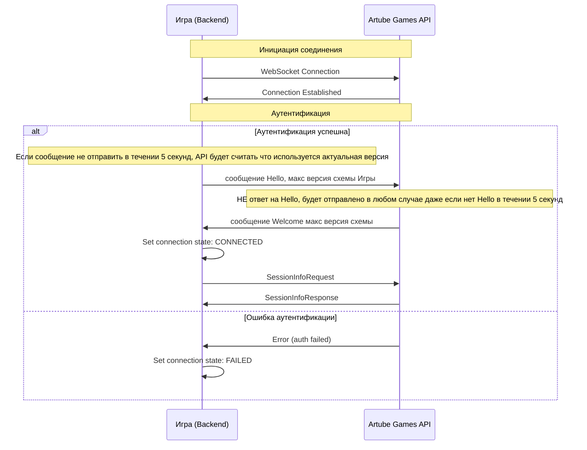

<!-- Source: https://docs.artube-888.live/ru/integration-process/games-api/general-flow/connection/ -->

# Установление соединения

Аутентификация достигается за счёт добавления хедеров в запрос на инициализацию.

```json
headers: {
  'X-Api-Key': 'api_key',
  'X-Game-ID': 'my-game',
}
```

> Осторожно
>
> Game ID можно передавать в URL подключения к Games API, например: `ws://hub-dev.artube-888.live/v1/ws?game={GAME_ID}`

## Последовательность подключения

### Схема установления соединения



> Важно
>
> SessionInfoRequest\SessionInfoResponse не являются частью установки соединения. Однако для любых последующих RPC действий необходим в первую очередь этот вызов

## Hello

### Структура Hello

```json
{
  "proto": 1,
  "schema": 1,
  "chan": "control",
  "type": "Hello",
  "id": "hello-request-id",
  "op_seq": 1,
  "timestamp": "2023-10-28T10:00:00.000Z",
  "payload": {
    "supports": {
      "max_schema": 1
    }
  }
}
```

## Welcome

### Структура Welcome

```json
{
  "proto": 1,
  "schema": 1,
  "chan": "control",
  "type": "Welcome",
  "id": "welcome-response-id",
  "corr_id": "hello-request-id",
  "op_seq": 1,
  "timestamp": "2023-10-28T10:00:01.000Z",
  "payload": {
    "use": {
      "max_schema": 1
    }
  }
}
```

## Поддержание соединения (keep-alive)

> Обязательное требование
>
> Игровой сервер (клиент WebSocket) **не должен самостоятельно обрывать** установленное WebSocket-соединение с Games API во время активной работы. Соединение должно оставаться открытым на всё время работы игрового сервера с данной сессией/игроком.

Games API поддерживает соединение на транспортном уровне с помощью нативных WebSocket ping/pong кадров: сервер отправляет ping с интервалом **15 секунд** (`KeepAliveInterval`). Игровой сервер обязан:

- **не закрывать** соединение по собственной инициативе (кроме штатного завершения работы приложения или явной команды закрытия сессии со стороны платформы);
- корректно отвечать на протокольные ping-кадры WebSocket (эта функциональность реализуется на уровне стандартной WebSocket-библиотеки клиента и обычно не требует ручной реализации);
- обрабатывать разрыв соединения со стороны сети как исключительную ситуацию и реализовывать переподключение с повторным прохождением Hello/Welcome и `SessionInfoRequest`/`SessionInfoResponse`, а не как штатное поведение.

> Заметка
>
> Если соединение всё же было разорвано (сетевой сбой, рестарт пода игры и т.п.), необходимо переподключиться и заново выполнить полную последовательность подключения (Hello → Welcome → SessionInfoRequest → SessionInfoResponse) перед продолжением работы с раундами.

## Связанные разделы

- **[Игровые сессии](sessions.md)** - управление сессиями
- **[Hello запрос](../../../games-api-integration/control-requests/hello.md)** - детали протокола
- **[Welcome ответ](../../../games-api-integration/control-requests/welcome.md)** - обработка подтверждения
