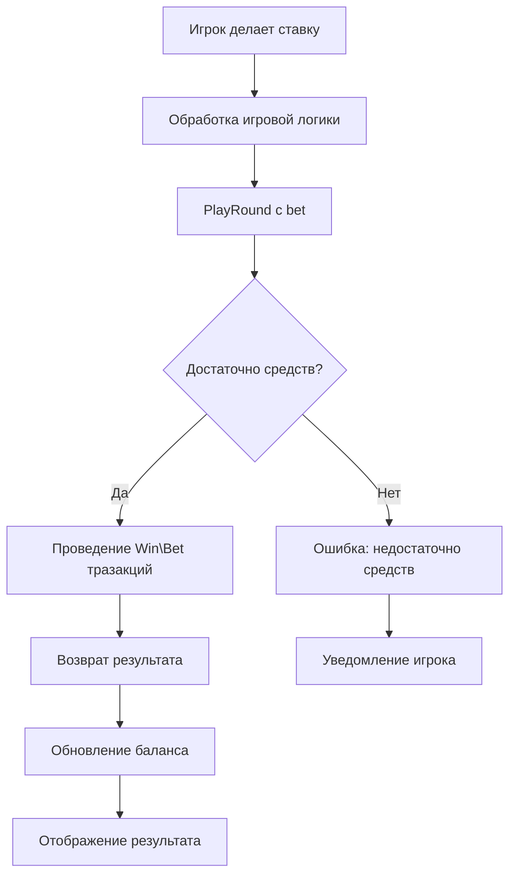
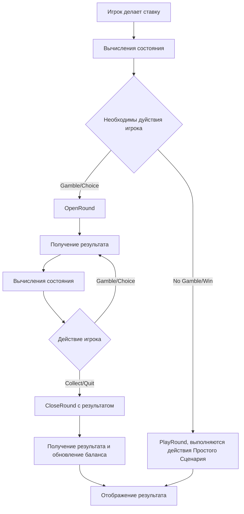
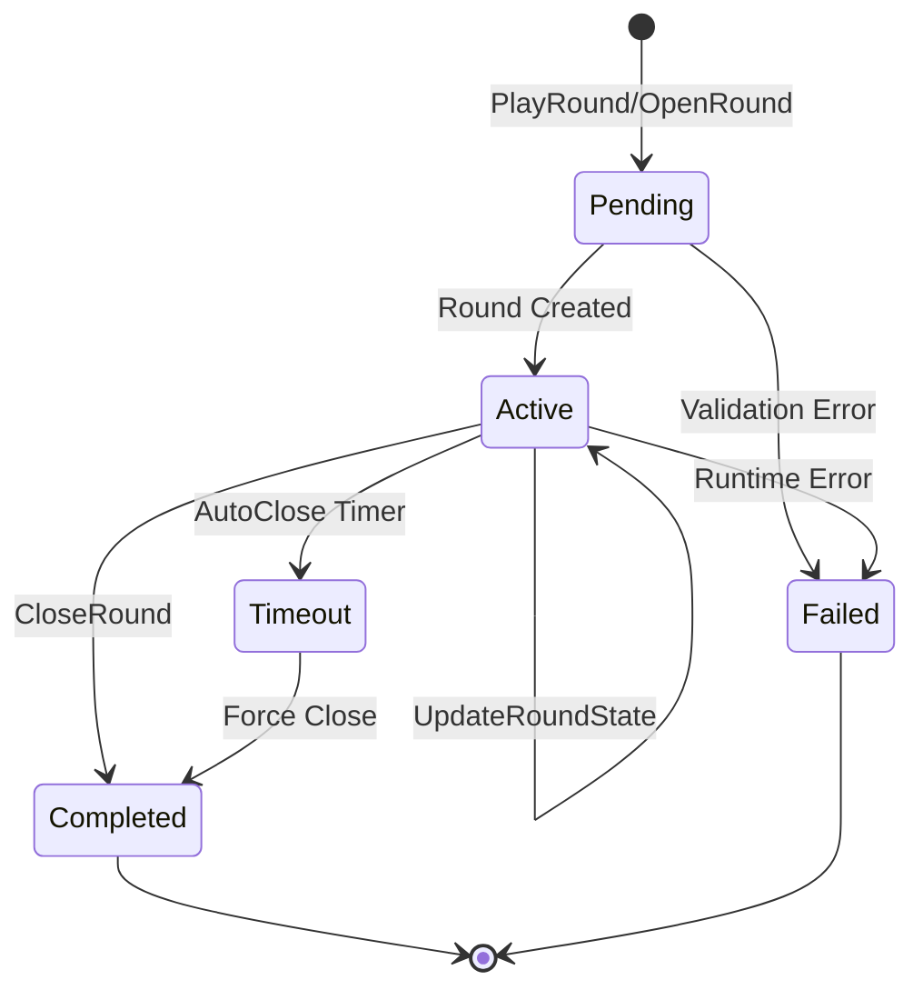

<!-- Source: https://docs.artube-888.live/ru/integration-process/games-api/general-flow/game-cycles/ -->

# Игровые циклы

## Типы игровых циклов

### Простая игра (слоты, рулетка)



### Сложная игра (интерактивные слоты)



## Примеры потоков сообщений

### Успешный простой раунд

```json
// 1. Игровой раунд
{
  "type": "PlayRoundRequest",
  "payload": {
    "session_id": "12345678-1234-5678-9abc-123456789012",
    "price_multiplier": 2.00,
    "bet_index": 3,
    "win_multiplier": 5.50,
    "free_round_campaign_id": "uuid-string", //nullable
    "features": [{"type": "BuyFeature", "description": "..."}],
    "round_state_version": "1.1",
    "round_state": "{\"step\": 2, \"result\": \"win\"}"
  }
}

// 2. Результат раунда
{
  "type": "PlayRoundResponse",
  "payload": {
    "round_id": "87654321-4321-8765-dcba-210987654321",
    "balance": 153.75,
    "free_round_campaign": { //nullable
        "rounds_left": 5,
        "total_win": 10.00,
        "is_complete": false
    }
  }
}
```

### Сложный раунд с интерактивом

```json
// 1. Начало раунда
{
  "type": "OpenRoundRequest",
  "payload": {
    "session_id": "12345678-1234-5678-9abc-123456789012",
    "price_multiplier": 1.50,
    "bet_index": 2,
    "free_round_campaign_id": "uuid-string", //nullable
    "round_state_version": "1.0",
    "round_state": "{\"step\": 1, \"reels\": [1,2,3,4,5], \"bet_level\": 2}"
  }
}

// 2. Начальное состояние
{
  "type": "OpenRoundResponse",
  "payload": {
    "round_version": 0,
    "round_id": "round_abc",
    "balance": 148.25
  }
}

// 3. Обновление состояния (основное вращение)
{
  "type": "UpdateRoundStateRequest",
  "payload": {
    "round_id": "round_abc",
    "session_id": "12345678-1234-5678-9abc-123456789012",
    "round_id": "87654321-4321-8765-dcba-210987654321",
    "round_version": 0,
    "round_state_version": "1.2",
    "round_state": "{\"game_phase\":\"base_completed\",\"base_win\":50.00,\"gamble_available\":true}"
  }
}

// 4. Действие игрока (выбор gamble)
{
  "type": "UpdateRoundStateRequest",
  "payload": {
    "round_id": "round_abc",
    "session_id": "12345678-1234-5678-9abc-123456789012",
    "round_id": "87654321-4321-8765-dcba-210987654321",
    "round_version": 0,
    "round_state_version": "1.2",
    "round_state": "{\"game_phase\":\"gamble_playing\",\"color_choice\":\"red\"}"
  }
}

// 5. Завершение раунда
{
  "type": "CloseRoundRequest",
  "payload": {
    "session_id": "12345678-1234-5678-9abc-123456789012",
    "round_id": "round_abc",
    "win_multiplier": 4.00,
    "status": "completed",
    "features": [{"type": "BuyFeature", "description": "..."}],
    "round_version": 1,
    "round_state_version": "1.3",
    "round_state": "{\"step\": 4, \"final_result\": \"completed\"}"
  }
}

// 6. Финальный результат
{
  "type": "CloseRoundResponse",
  "payload": {
    "balance": 163.75,
    "free_round_campaign": { //nullable
      "rounds_left": 5,
      "total_win": 10.00,
      "is_complete": false
    }
  }
}
```

## Состояния раунда

### Жизненный цикл раунда



> Заметка
>
> **Внутренняя специфика:** Artube автоматически закрывает неактивные раунды для предотвращения “зависших” состояний.

## Связанные разделы

- **[Установление соединения](connection.md)** - подключение к API
- **[Игровые сессии](sessions.md)** - управление сессиями
- **[Простой раунд](../simple-round.md)** - одношаговые игры
- **[Сложный раунд](../complex-round.md)** - интерактивные игры
