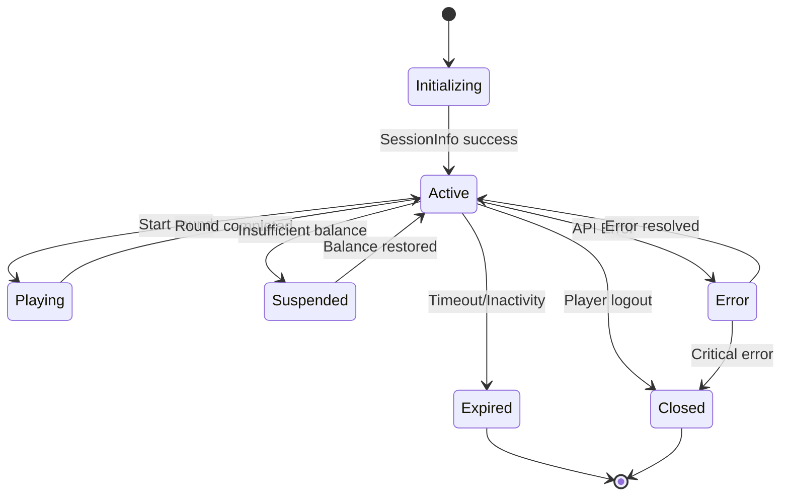

<!-- Source: https://docs.artube-888.live/ru/integration-process/games-api/general-flow/sessions/ -->

# Игровые сессии

## Жизненный цикл сессии

### Состояния сессии

```mermaid
stateDiagram-v2
    [*] --> Initializing
    Initializing --> Active : SessionInfo success
    Active --> Playing : Start round
    Playing --> Active : Round completed
    Active --> Suspended : Insufficient balance
    Suspended --> Active : Balance restored
    Active --> Expired : Timeout/Inactivity
    Active --> Closed : Player logout
    Expired --> [*]
    Closed --> [*]

    Active --> Error : API Error
    Error --> Active : Error resolved
    Error --> Closed : Critical error
```
