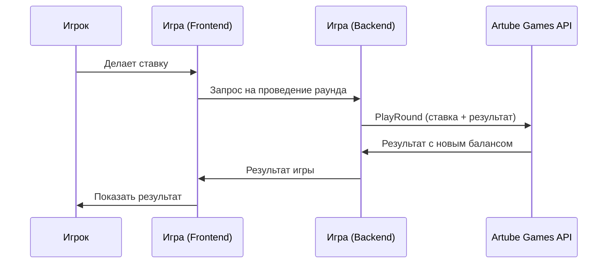

<!-- Source: https://docs.artube-888.live/ru/integration-process/games-api/simple-round/ -->

# Простой раунд

## Обзор простого раунда

Простой раунд - это игровой цикл без интерактивных элементов, где весь процесс от ставки до результата выполняется в одной операции. Подходит для слотов, рулетки, лотерей и других игр, где игрок не принимает решений во время раунда.

## Схема простого раунда

## Характеристики простого раунда

### ✅ Подходит для:

- **Слоты** - вращение барабанов с мгновенным результатом
- **Рулетка** - ставка на число/цвет с определенным исходом
- **Лотереи** - покупка билета с мгновенным розыгрышем
- **Краш-игры** - ставка с заранее определенным коэффициентом
- **Кено** - выбор чисел с автоматическим розыгрышем

### ❌ Не подходит для:

- **Покер** - требует выбора карт и решений
- **Блэкджек** - hit/stand решения
- **Интерактивные бонусы** - выбор призов игроком
- **Турниры** - множественные раунды с взаимодействием

## Разделы документации

### 📋 Структура запроса

Детальное описание полей и структуры PlayRound запроса.

→ [Изучить структуру](../../games-api-integration/game-requests/play-round.md)

> Совет
>
> Простой раунд идеально подходит для большинства казино-игр. Используйте его везде, где игрок не принимает решений во время раунда.

## Лучшие практики

- Просчитывайте математику прежде чем открывать раунд
- Используйте PlayRoundRequest чтобы отыграть раунд с нулевым выигрышем если используете сложный раунд для раундов с выигрышами

## Связанные разделы

- **[Сложный раунд](complex-round.md)** - для интерактивных игр
- **[Транзакционная модель](transaction-model.md)** - принципы работы с деньгами
- **[Примеры простых раундов](../../games-api-integration/examples/simple-round-examples.md)** - детальные сценарии
