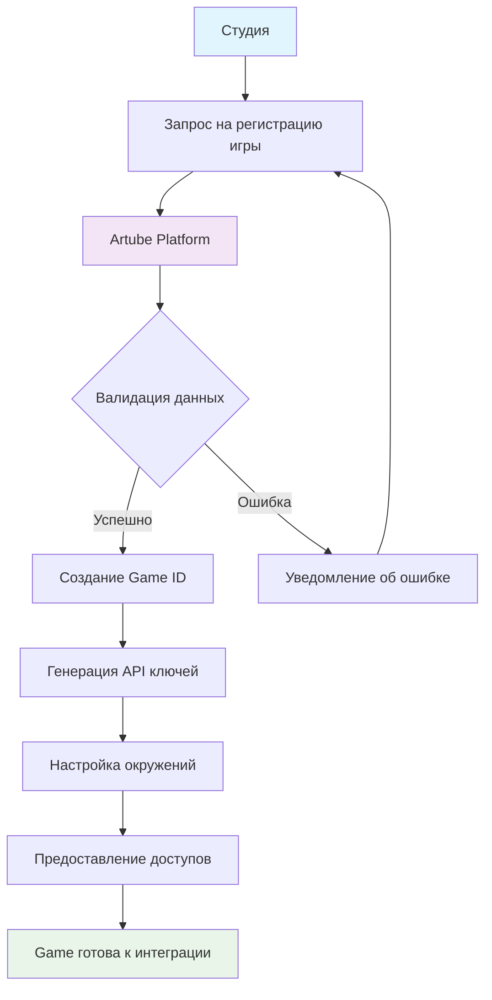

<!-- Source: https://docs.artube-888.live/ru/integration-process/new-game-registration/ -->

# Регистрация новой игры

## Обзор процесса

Регистрация новой игры - это процесс создания игрового проекта в системе Artube, настройки его параметров и получения необходимых идентификаторов для интеграции.

## Схема регистрации игры



## Процесс регистрации

1. **Подготовка информации об игре**

   Соберите следующую информацию:

   - Название игры
   - Жанр и тип игры
   - Планируемая архитектура (клиент-сервер)
   - Ожидаемая нагрузка
   - Особые требования к интеграции
2. **Техническая валидация**

   Команда Artube проверяет:

   - Совместимость с платформой
   - Технические требования
   - Соответствие политикам безопасности
3. **Создание игрового проекта**

   После одобрения создается:

   - Уникальный Game ID
   - API ключи для окружений
   - Доступы к инструментам

## Что вы получите

### 🎯 Идентификаторы игры

- **Game ID** - уникальный идентификатор игры в системе
- **API Keys** - ключи для Develop окружения и для Production после успешного прохождения всего процесса
- **Repository URLs** - endpoints для загрузки кода и ресурсов

### 🛠 Настройки проекта

- **Game Configuration** - параметры игры
- **Analytics Setup** - конфигурация сбора метрик
- **Security Policies** - правила безопасности

### 📊 Инструменты мониторинга

- **Dashboard** - панель управления игрой
- **Metrics Collection** - сбор игровых метрик
- **Performance Monitoring** - контроль производительности

## Настройка после регистрации

### 1. Верификация API доступа

После регистрации протестируйте подключение:

**Конфигурация игры:**

- Установите Game ID (полученный при регистрации)
- Используйте API ключ для соответствующего окружения
- `sandbox` для локальной разработки, `develop` для тестирования или `production` для релиза

> Совет
>
> Всё, что связано со средой песочницы, вы настраиваете самостоятельно. Для получения дополнительной информации нажмите, [Sandbox - mock-окружение GamesAPI](../game-development/games-api-mock/mock-tests-description.md).

**Тест подключения к Artube Games API:**

- Используйте Api Key авторизации в заголовке ‘X-Api-Key’
- Передайте Game ID в в заголовке ‘X-Game-ID’

```javascript
// Пример с Node.js
const WebSocket = require('ws');

const ws = new WebSocket('ws://localhost:5076/v1/ws', ['json'], {
    headers: {
        'X-Game-ID': 'test-game-001',
        'X-Api-Key': 'your-api-key'
    }
});
```

> Осторожно
>
> Game ID можно передовать в URL поддключения к Games API например `ws://hub-dev.artube-888.live/v1/ws?game={GAME_ID}`

### 2. Базовая интеграция

Минимальная интеграция включает:

- **Session Management** - управление игровыми сессиями
- **Game Round Handling** - обработка игровых раундов
- **Payment Processing** - обработка платежей
- **Error Handling** - обработка ошибок

## Ограничения и особенности

- **Лобби (Artube Hub) ** - доступно
- **Расширенная аналитика** — доступна по запросу

## Следующие шаги

После успешной регистрации игры:

1. **[Изучите транзакционную модель](games-api/transaction-model.md)** - основа всех операций
2. **[Настройте среду разработки](../game-development/games-api-mock/mock-tests-description.md)** - подготовьте инструменты
3. **[Реализуйте простой раунд](games-api/simple-round.md)** - первая интеграция

> Совет
>
> Рекомендуем начать с реализации простого раунда в окружении Sandbox, прежде чем переходить к сложной игровой логике.
